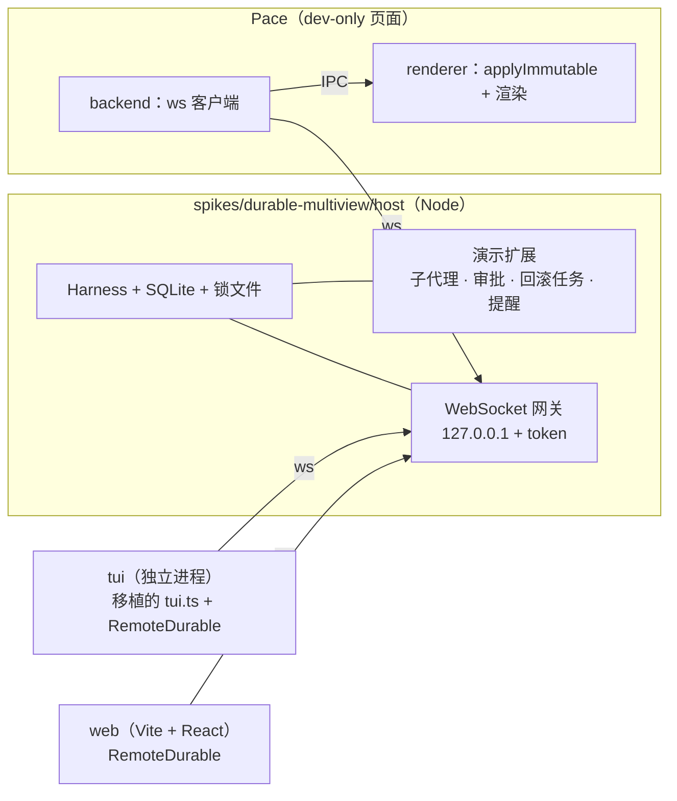

# Handoff：Pi Durable 多端同屏 spike

- 日期：2026-10-02
- 状态：P0–P5 完成（见 §10–§16），待 PR 栈审阅。PR 栈：P0 [#426](https://github.com/bubbleptr/pace/pull/426) ← P1 [#427](https://github.com/bubbleptr/pace/pull/427) ← P2 [#429](https://github.com/bubbleptr/pace/pull/429) ← P3 [#430](https://github.com/bubbleptr/pace/pull/430) ← P4a [#431](https://github.com/bubbleptr/pace/pull/431) ← P4b `feat/durable-multiview-demo-ui` ← P5 `feat/durable-multiview-conclusion`。前置的 Pi 1.0 升级 [PR #425](https://github.com/bubbleptr/pace/pull/425) 已合入。
- 关联：[docs/research/pi-durable-analysis.md](../../docs/research/pi-durable-analysis.md)（框架分析，用户的写作素材，只在本地工作区，不提交）、[ADR-0040](../../docs/adr/0040-root-session-process-isolation.md)、[ADR-0042](../../docs/adr/0042-pace-as-chord-presentation-host.md)、[ADR-0044](../../docs/adr/0044-single-writer-session-projection-in-renderer.md)
- 目的：把上一个会话里已核实的事实、已定的决策和待决问题交给新会话，避免重查。

## 1. 目标

一个 Durable 宿主进程上跑一个演示任务（包含子代理），三个界面**同时**显示并能驱动它：

1. 服务器上的 TUI（先在本机模拟服务器）；
2. 浏览器里的 Web UI；
3. 本机的 Pace（一个 dev-only 页面）。

演示要尽量把 Durable 的特性都用上（见 §6）。spike 的另一半价值是回答「Pace 将来接入 Durable 需要什么」，最后写成结论文档。

## 2. 已定的决策（用户已确认）

| 问题 | 决定 |
|---|---|
| 本机 GUI | Pace 里加一个 dev-only 页面，连到宿主（不是另做 Electron 壳） |
| 代码位置 | Pace 仓库内（先升级到 Pi 1.0 消除版本冲突，见 PR #425） |
| 模型 | 真模型，走 Pi 的 `ModelRuntime` 与 `~/.pi/agent` 凭据（与 `pi` 共用登录） |
| 服务器 | 先全部在本机跑通，宿主只监听 `127.0.0.1`，以后搬到服务器加 SSH 隧道 |
| TUI | 移植上游 durable 编码 Agent 的 `tui.ts`，接远程版 `DurableView` / `DurableController`，TUI 是独立客户端进程 |

架构上的关键选择：**宿主是一个无界面进程**，独占 Harness 与 SQLite；TUI、Web、Pace 三端地位相同，都是客户端。这样「`kill -9` 宿主 → 三端显示重连 → 重启宿主后三端续上」这一幕才演得出来。

## 3. 已核实的事实

### 3.1 Durable 本身

- 包：`@earendil-works/pi-durable@1.0.0`，依赖 `chord ^1.0.0`、`pi-ai ^1.0.0`、`typebox 1.3.27`、`diff 8.0.4`；`engines.node >= 22.19.0`。本机 Node 是 v25.9.0。**它还不是 Pace 的依赖，spike 要自己加，建议锁精确版本**（README 第一行：API 会无预告变化）。
- 一份存储同一时间只能被一个进程打开，没有跨进程锁（README「Storage」）。上游 durable 编码 Agent 用 `proper-lockfile` 加了锁文件，崩溃留下的锁 10 秒后失效。宿主应照做。
- `Conversation.watch()` 返回 `WatchHandle<ConversationView>`：`value` 是当前值，`start((value, ops, ctx) => Promise<void>)` 每次提交给出 `ops`。慢消费者积压超过 100 帧会被替换为一帧完整视图；重连从当前视图开始，不回放。
- `ops` 的类型是 `@earendil-works/chord/delta` 的 `Op`，纯 JSON 元组（源码注释：「Tuples are the form — in memory, on the wire, on disk」）。客户端用同一模块的 `applyImmutable(target, ops)` 还原，**客户端不需要加载 Harness**。delta 模块对 `__proto__` 路径有防护，客户端务必用它而不是自己写 applier。
- 其他可订阅状态：`harness.taskGraph()` / `watchTaskGraph()`，`harness.documentState(Doc, id)` / `watchDoc()`，`harness.subscribeCommits()`（发现新会话，比如新子代理）。
- 定时器：`TaskRuntime.sleep(until)`，`until` 是绝对时间，要存在输入或检查点里才能跨重启。
- `TaskOptions.background` 只对 `ownership: { kind: "conversation" }` 的任务有效。
- 钩子的 `api`（`HookApi`）只有 `taskId`、`conversationId`、`memo()` 和文档读取（`snapshot`）。**钩子没有 sleep，也拿不到会话句柄**（影响 §8 的审批设计）。

### 3.2 上游参考代码（Pi 仓库 main，MIT）

- 两种子代理示例：[`22-subagent-foreground.ts`](https://github.com/earendil-works/pi/blob/main/packages/durable/test/examples/22-subagent-foreground.ts)（子会话归工具调用所有，`replay: "safe"`，用 `scanConversations({ ownerTaskId })` 找回）和 [`23-subagent-background.ts`](https://github.com/earendil-works/pi/blob/main/packages/durable/test/examples/23-subagent-background.ts)（Anchor + Reporter 两个 background 任务、`app.subagents` 文档、工具 `replay: "unsafe"`）。
- durable 编码 Agent：[`packages/coding-agent/src/experimental/durable/`](https://github.com/earendil-works/pi/tree/main/packages/coding-agent/src/experimental/durable)，文件为 `main.ts`、`runtime.ts`、`tui.ts`（约 25KB）、`subagent.ts`、`harness-setup.ts`、`prompt.ts`、`sessions.ts`。**不在 npm 发布物里**。
- **`runtime.ts` 的接缝就是我们要的客户端契约**：`DurableViewSource { current(); subscribe(listener) }`，`DurableView`（「Plain values; no Harness objects cross this boundary」：`session`、`conversation: ConversationView`、`conversations`、`models`、`notices`、`tasks?: TaskGraph`），`DurableController`（`submit(text, whenBusy)`、`compact`、`abort`、`cycleThinking`、`setModel`、`toggleTasks`、`switchConversation`）。`tui.ts` 只依赖这三样加 `SettingsManager`。README 原话：「Nothing in the TUI handles recovery; it only renders the conversation view.」
- `tui.ts` 用到的 Pi 内部模块，1.0 npm 包（`@earendil-works/pi-coding-agent` 根入口）导出情况：

| 已导出 | 未导出（需要替代） |
|---|---|
| `AssistantMessageComponent`、`ToolExecutionComponent`、`UserMessageComponent`、`CustomEditor`、`DynamicBorder`、`initTheme`、`getMarkdownTheme`、`KeybindingsManager`、`keyText`、`getAgentDir`、`SettingsManager`、`ModelRuntime`、`resolveCliModel` | `createAllToolRenderers`、`WorkingStatusIndicator`、`getEditorTheme`、`InteractiveThemeController`、`formatTokens`、`findInitialModel`、`configureHttpDispatcher`、`applyHttpProxySettings` |

  未导出的可以按文件路径引 `dist/...`（Pace 对 mcp 就是这么做的，见根 `vite.config.ts` 的 `@pace/pi-mcp` 别名），或者拷一份进 spike 并注明出处。

- **HTTP dispatcher 必须配置。** 上游 `harness-setup.ts` 的注释：「pi's HTTP setup: proxy, idle timeouts, and one undici for fetch. Without it, some provider streams break off.」实现在 Pi 的 `src/core/http-dispatcher.ts`（undici 全局 dispatcher、默认空闲超时 300 s、`autoSelectFamilyAttemptTimeout` 2 s、吞掉 undici 的内部 `error` 事件）。Pace 后端里没有对应代码（搜不到 `setGlobalDispatcher`），宿主要自己补。

### 3.3 Pace 侧约束

- **Pace renderer 的 CSP 是 `connect-src 'self'`**（`apps/desktop/index.html`），renderer 不能直连 `ws://127.0.0.1`。两条路：
  - a）（推荐）由 Pace backend（utilityProcess）当 WebSocket 客户端，经现有 IPC 把快照和 ops 转给 renderer，renderer 只做 `applyImmutable` 和渲染。这和 ADR-0042 的「transport 复用进程 IPC」、ADR-0044 的单写者投影一致，也是 spike 要验证的路径。
  - b）只在 dev 下放宽 CSP。改动小，但验证不到 Pace 真实的接入路径。
- 根 `tsconfig.json` 只 include `apps` 和 `packages`；`bun` workspaces 是 `apps/*`、`packages/*`；根 `vitest run` 会收集**整个仓库**的测试文件，默认 jsdom 环境（`vite.config.ts`）。spike 放在 `spikes/durable-multiview/` 时要：把 `spikes/*` 加进 workspaces（依赖走根 lockfile），在根 vitest 的 `exclude` 加 `spikes/**`，spike 用自己的 `tsconfig.json` 和 `vitest.config.ts`（node 环境）。
- AGENTS.md：新增 `shared/ui/` 组件要上 `/design`；dev 页面优先用 Astryx 组件（`bunx astryx build "<idea>"`），不手写 div/hex。
- 宿主跑在 Node 上（Durable 的 SQLite 适配器与 engines 要求），不要用 Bun 运行宿主。

## 4. 架构



建议的目录（新会话可调整）：

```text
spikes/durable-multiview/
  host/        Harness、演示扩展、网关、HTTP dispatcher、锁
  protocol/    帧类型、RemoteDurable（DurableViewSource + DurableController 的远程实现）
  tui/         移植的 tui.ts（保留 MIT 出处）+ main
  web/         Vite + React
  cli/         P0 用的命令行观察器
```

Pace 页面放在 `apps/desktop/src/pages/` 下的 dev-only 路由，backend 侧桥接放 `packages/backend/src/`，用开关隔离，spike 结束可整体删除。

## 5. 网关协议草案

- 流（stream）：`conversation:<id>`（`watch()`）、`tasks`（`watchTaskGraph()`）、`doc:<kind>:<conversationId>`（`watchDoc()`）、`conversations`（由 `subscribeCommits()` 维护的会话列表）、`notices`。
- 服务端 → 客户端：`{ type: "snapshot", stream, value }`、`{ type: "ops", stream, ops }`、`{ type: "result", id, value | error }`。
- 客户端 → 服务端：`{ type: "subscribe" | "unsubscribe", stream }`、`{ type: "call", id, method, args }`。`method` 对齐 `DurableController`，另加 `fork`、`configure`、`approve`、`reset`。
- 重连：重新 `subscribe`，拿新快照；客户端不做历史回放。
- 鉴权：启动时生成 token，客户端连接时带上；只监听 `127.0.0.1`。
- 背压：服务端每个客户端一个发送队列；依赖 `watch()` 自带的 100 帧折叠。

## 6. 演示剧本与特性覆盖

场景：值班 Agent 调查「v2.3 发布失败」。**所有工具都是模拟的，不装 `CodingTools`/bash**：任何客户端都能驱动 Agent，工具又在宿主机上执行。

| 步骤 | Durable 特性 | 三端看到 |
|---|---|---|
| 1. 提问，主 Agent 写调查计划到待办 | 文档（同提交） | 待办实时同步 |
| 2. 并行派 3 个前台子代理（日志 / 指标 / 提交历史） | 所有权树、并行工具、`api.output`、`details` 挂载 | 任务图，子代理挂在调用下 |
| 3. 调查中途 `kill -9` 宿主，再重启 | 检查点恢复、`replay: "safe"` 只重跑未完成、`requestId` 找回子代理 | 三端断线 → 续上 |
| 4. TUI steer，网页排 follow-up | inbox 语义 | 队列三端可见 |
| 5. Pace 里切到某个子代理并直接 steer | 子会话即普通会话 | 任一端驱动任一会话 |
| 6. 提出回滚，触发审批钩子 | `beforeTool` + memo（先写者胜） | 三端同时弹审批，先点的生效；审批后崩溃不再问 |
| 7. 回滚为自定义任务，3 个区域并行，一个失败 | `defineTask`、`waiting` + `failFast`、自下而上 abort 补偿 | 任务图里兄弟节点被中止、补偿 |
| 8. Esc；「60 秒后复查」提醒照样触发 | background 边界、`runtime.sleep` | 提醒以 follow-up 出现 |
| 9. 网页在某条消息处 fork「写复盘」并去掉回滚工具 | fork、按会话配置工具、文档 fork 语义 | 会话列表多一个分支 |
| 10. Pace 发起手动压缩 | 压缩是任务，不打断对话 | 压缩状态三端可见 |
| 11. 改扩展文件，宿主热替换 | Registry 原地替换 | 下一次工具输出格式变化 |
| 12. 用量面板 | `pi.usage` | 用量 |

覆盖不到：自定义存储后端、Bun / Durable Object 运行、提示缓存差量、任务版本迁移。

真模型的代价：子代理不一定按剧本派出，崩溃时机也要看着任务图手动掐。用子代理工具的描述和会话 `instructions` 把流程写死一些；工具输出用 `api.output` 慢速流出，给崩溃演示留时间窗。

## 7. 分阶段与验收

| 阶段 | 内容 | 验收 |
|---|---|---|
| P0 | 宿主（锁、HTTP dispatcher、ModelRuntime、最小扩展）、网关、`protocol` 的 RemoteDurable、命令行观察器 | 两个观察器看到同一段流式输出；`kill -9` 宿主再重启，两端自动续上且转录一致 |
| P1 | 移植 TUI | TUI 作为远程客户端完成提问、steer、abort、切会话、任务面板 |
| P2 | Web UI | 与 TUI 同时连接，状态一致 |
| P3 | Pace dev 页面（backend ws 客户端 + IPC + renderer 投影） | 三端同屏 |
| P4 | 演示扩展与剧本（§6） | 剧本能完整走一遍，崩溃与热替换各演示一次 |
| P5 | `docs/research/` 结论文档 | 回答：Pace 接入 Durable 的传输、投影、子代理呈现、进程模型各需要什么，与 ADR-0040/0042/0044 的冲突点 |

每个阶段先写失败测试（宿主与协议用 vitest node 环境；网关可以用真 WebSocket 起本地端口测）。

## 8. 待决问题

1. **审批钩子怎么等人点。** `HookApi` 没有 sleep，也没有会话句柄。候选：
   - a）钩子里用普通 `setTimeout` 轮询 `snapshot(ApprovalsDoc)`，拿到结果立刻写 memo。轮询本身不持久，但重启后钩子重跑，会先读 memo，所以语义正确。
   - b）不用钩子，做成工具：`request_approval` 创建一个 Approval 任务，任务用 `runtime.sleep` 轮询文档并持久等待，`rollback` 工具检查审批结果。
   
   建议先试 a），不顺再换 b）。客户端点击走网关的 `approve` 调用，由宿主提交到 `ApprovalsDoc`。
2. **Pace 页面走 §3.3 的 a）还是 b）。** 推荐 a）。
3. **`tui.ts` 缺失导出的替代**：按路径引 `dist` 还是拷贝。前者随 Pi 升级自动跟进但可能断，后者稳定但要注明出处。
4. **子代理用前台还是后台写法**：剧本步骤 2 用前台（示例 22）；如果想演示「主 Agent 不被阻塞、子代理跨轮常驻」，再加一个后台子代理（示例 23）。
5. 真模型用哪个 provider：读 `~/.pi/agent/settings.json` 的默认模型即可，宿主启动时打印出来。

## 9. 新会话的起步步骤

1. 确认 PR #425 已合入；在主检出上 `git checkout main && git pull`，删掉本地 `chore/upgrade-pi-1.0`。
2. `git fetch && git checkout -b feat/durable-multiview-spike origin/main`。
3. 只把本文件提交进该分支。`docs/research/` 下的 `pi-durable-analysis.md`、`pi-durable-evidence.md`、`pi-durable-visual-guide.md` 是用户写文章的素材，留在工作区、**不提交**，`git add` 时不要用 `-A` 或 `.`。
4. 读上游 `runtime.ts`、`tui.ts`、`harness-setup.ts`、示例 22/23（链接见 §3.2）。本机有 1.0.0 的 tarball 解包可直接对照：`/private/tmp/pi1/`（`pi-durable`、`pi-coding-agent`、`chord`）。
5. 按 §7 从 P0 开始，先定 workspace / vitest / tsconfig 的接入方式（§3.3）。

## 10. P0 进展（2026-10-02）

### 10.1 落地的内容

- `spikes/durable-multiview/` 是 bun workspace 包 `@pace/durable-multiview-spike`，依赖锁精确版本（pi-durable / chord / pi-ai / pi-coding-agent 均为 1.0.0，`ws`、`proper-lockfile`、`undici`）。根 `package.json` 的 workspaces 加了 `spikes/*`，根 vitest `exclude` 加了 `spikes/**`；spike 有自己的 `tsconfig.json`（NodeNext、`allowImportingTsExtensions`、`erasableSyntaxOnly`）和 `vitest.config.ts`（node 环境）。源码直接用 Node 25 的类型剥离运行，不需要构建。
- `host/`：`host.ts`（`openHost`：锁、持久 token、SQLite、Harness、网关、`resume()`）、`gateway.ts`（WebSocket 网关）、`main.ts`（入口，`--faux` 用假模型，否则走 `ModelRuntime` 与 `~/.pi/agent`）、`pi-setup.ts`（上游 `harness-setup.ts` 的设置读取）、`http-dispatcher.ts`（从 Pi 拷贝，注明出处）。
- `protocol/`：`frames.ts`（帧类型）、`view.ts`（与上游 `DurableView` / `DurableController` 结构一致，只多一个 `connection` 字段）、`remote-durable.ts`（`connectRemoteDurable`）、`transcript.ts`（转录与流式文本提取）。
- `cli/observe.ts`：命令行观察器，能看也能发（普通行为提问或 follow-up，`/steer`、`/abort`、`/tasks`）。
- 运行：`node host/main.ts` 起宿主（默认端口 7420，数据目录 `~/.pi/agent/experimental/durable-multiview/default`），另开终端 `node cli/observe.ts`。spike 测试：在 spike 目录下 `bun run test`。

### 10.2 验收

- `test/gateway.test.ts`：宿主在测试进程内，两个远程客户端看到同一段流式输出（B 端收到的每个片段都是最终答案的前缀），最终视图逐字段相等；错误 token 被拒；会话列表与任务图订阅可用。
- `test/crash-recovery.test.ts`：宿主作为子进程，流式到一半 `kill -9`，两端进入 `reconnecting`，同端口重启后两端自动续上，转录一致。连跑 5 次稳定。
- 真模型冒烟：`radius/deepseek-v4.1-flash`（读自 `settings.json`）经宿主答复正常。

### 10.3 新发现（P1 之后要用）

- **崩溃后转录里会多一条 aborted 助手消息。** 规格 §8.1 / §8.3：被打断的已提交片段会变成一条 `stopReason: "aborted"` 的 `pi.assistant` 条目，留在转录里但不进入模型上下文，然后用同样的上下文重发请求。所以崩溃后的转录是「用户 → aborted 片段 → 完整答案」。三端 UI 都要把 aborted 条目区分渲染（观察器标 `[aborted]`），剧本 §6 第 3 步的讲解要提这一点。
- **`ConversationId` 是带品牌的 number**，不是字符串。流名 `conversation:<id>` 解析时要 `Number(...)`。
- **`watch()` 与 `viewState()` 的区别**：上游 TUI 用的是进程内的 `viewState()`（Chord 已挂载状态，只给值）；网关用 `watch()`，它给 `ops`，并且 listener 返回的 Promise 起背压作用。网关在 socket 写入回调后才 resolve，慢客户端的积压由 `watch()` 自己折叠。
- **token 要持久化**（数据目录下 `token`，0600）。如果每次启动都重新生成，`kill -9` 重启后客户端就连不上了。鉴权失败时用关闭码 4401，这样浏览器也能读到原因（浏览器 WebSocket 拿不到 HTTP 状态码）。
- **`submit` 带 `requestId`**（客户端生成 UUID），为「回复丢了再重发不重复提交」做准备；目前客户端还不会自动重发。
- §3.1 里与 P4 相关的事实（`TaskOptions.background`、`HookApi` 的能力）本阶段没有复核，P4 用到时再核。

## 11. P1 进展（2026-10-02）：TUI 远程客户端

### 11.1 落地的内容

- `tui/tui.ts`：上游 `tui.ts`（earendil-works/pi@7fbbd5f）的移植。保留上游的 tab 缩进，和上游 `diff` 时只显示真正的改动：导入来源、本地的 `agentOf`，以及连接状态提示（`reconnecting` / `closed`）。
- `tui/pi-internals.ts`：**§8.3 的决定是按路径引用 dist，不拷贝。** 用相对路径 `../node_modules/@earendil-works/pi-coding-agent/dist/...` 引入，Node 和 TypeScript 都不会按 `exports` 检查相对路径；它经过的是和包根同一个符号链接，所以 `theme` 这类有状态的模块仍是单实例（已验证 `initTheme` 是同一个函数）。Pi 升级后路径变了，会在 typecheck 阶段报错。
- 比交接文档 §3.2 的表多出两个需要走路径引入的符号：`theme`（根入口只导出了 `Theme` 类型和函数），以及 `KeybindingsManager`（根入口只以 `export type` 导出，值要从 `dist/core/keybindings.js` 拿）。
- `tui/main.ts`：连上宿主后先 `toggleTasks()`，和上游一样默认打开任务面板。主题、快捷键、终端能力用本机的 `SettingsManager`，会话内容来自宿主。
- `cli/host-address.ts`：观察器和 TUI 共用的 `--url` / `--token` / `--data-dir` 解析。

### 11.2 验收

- `test/controller.test.ts`：两个客户端，一端驱动、另一端 steer，两端都能看到队列和 steer 后的那一轮；abort 后片段保留为 aborted 条目；切到另一个会话并对它说话，另一端仍停在 main；切到不存在的会话时给出错误通知，当前会话不变。
- `test/tui.test.ts`：在真实 pty（`@lydell/node-pty`，跑在 vitest 的 Node 上）里启动 TUI，输入的内容能被另一个客户端看到，答案渲染在屏幕上；宿主关闭后显示重连提示，Ctrl+D 以 0 退出。
- 手动用 headless xterm 抓屏走了一遍：流式输出、任务面板、steer、`/agents`、Esc 中止、`kill -9` 后重连。崩溃那一幕的画面是：半句话 → `reconnecting...` → 宿主重启后半句变成 `Operation aborted`，同一个 `pi.generation` 任务重新流式输出 → 完整答案。

### 11.3 新发现

- 用测试 API 直接建的 ownerless 会话 `pi.agent` 是空的（没有模型），提交会得到 `no_model`。子代理会话从父会话复制 agent 配置，不受影响。P4 造演示会话时要带上 `agent`。
- 崩溃的代价是重发一次请求：被打断那次的用量也计入 `pi.usage`（页脚从 `↑6 ↓29` 变成 `↑12 ↓58`）。剧本 §6 第 12 步讲用量时可以顺带提。
- `/agents` 现在只有 main，因为宿主还没装子代理扩展（P4）。协议层的会话切换已在测试里覆盖。

## 12. P2 进展（2026-10-02）：Web UI

### 12.1 落地的内容

- `presentation/chat.ts`：把 `ConversationView` 变成界面条目的纯函数，推导规则照搬上游 TUI，保证各端讲的是同一件事。包括 `chatItems`（消息、工具调用及其结果和运行中进度、子代理会话、aborted 片段、压缩、重置）、`statusText`、`queueItems`、`taskRows`（任务所有权树）。只用类型导入，浏览器可以直接用；**P3 的 Pace 页面可以复用它**。
- `web/`：Vite + React + Astryx（neutral 主题，和 Pace 一致），`bun run web` 起在 `127.0.0.1:5199`。
  - 左侧 `SideNav`：会话列表和连接状态点。
  - 中间 `ChatLayout`：Enter 在空闲时是提问、忙碌时是 steer，和 TUI 一样；另有 Follow-up 按钮；忙碌时发送按钮变成停止；底部有模型下拉、思考档位、Compact。
  - 右侧面板：任务树、队列、通知。
  - 断线时顶部显示 `Banner`，输入框禁用。
  - aborted 条目带橙色 `interrupted` 标签。
- token 放在 URL 的 `#fragment` 里，不会发给 dev server。宿主的 ready 行里多了一个 `web` 字段，就是完整链接。
- `web/tsconfig.json` 用 `Bundler` 解析：Astryx 的 `.d.ts` 是不带扩展名的相对再导出，`NodeNext` 下类型会全部退化。spike 的 `typecheck` 脚本两份配置都会检查。
- Vite 配置照 Pace 的做法固定一份 `react`（bun 在 `@astryxdesign/core` 下面嵌了第二份）。

### 12.2 验收

- `test/web.test.ts`：同时起 Vite dev server、Playwright Chromium 和 pty 里的 TUI，连同一个假模型宿主。网页提问，TUI 显示问题和答案；TUI 提问，网页显示问题和答案；观察器的转录是这四条；宿主关闭后网页显示重连提示；全程没有页面错误。又连跑了 3 次。
- `test/presentation.test.ts`：8 条，覆盖展示层推导。
- 截图核对：空页面、流式中（`Working...`、任务面板、停止按钮）、Follow-up 入队、两轮答完、宿主丢失（Banner、状态点变黄、输入框禁用），以及 `kill -9` 后重启（`interrupted` 标签加完整答案）。

### 12.3 新发现

- **根会话的 ID 是 1，不是 0。** 用 `ROOT_CONVERSATION_ID`，不要写死。
- **修复一个上游带过来的不一致**：网关启动时扫描会话列表照搬了上游的写法，不给 main 标题，但运行中提交监听器会给 main 补上标题。结果宿主重启后，main 在列表里的标题就没了。现在启动时 main 也取第一条用户消息作为标题；有测试覆盖重启前后列表一致。
- Astryx 的 `ChatComposer` 在 `isStopShown` 时 Enter 照样调用 `onSubmit`，只有按钮变成停止，所以 Enter 在忙碌时就是 steer，不需要单独的 steer 按钮。

## 13. P3 进展（2026-10-02）：Pace dev 页面（三端同屏）

### 13.1 落地的内容（§3.3 选了 a）

- **传输抽象**（`protocol/transport.ts`）：`RemoteDurable` 不再直接 new WebSocket，而是依赖 `FrameTransport`。实现有两种：`webSocketTransport`（TUI、网页、测试用）和 `relayTransport`（经注入的 `FrameRelay` 收发帧，Pace 用）。中继只搬运帧，ops 仍由客户端应用。
- **后端中继** `packages/backend/src/spikes/durable-bridge.ts`：按 `connectionId` 持有到宿主的 WebSocket（Electron utilityProcess 自带全局 `WebSocket`），帧原样转成 `seq: 0` 的临时事件 `durable_spike.frame` / `durable_spike.closed`，不写 journal，不分配序号，和终端流一样。`service.ts` 新增 `durable_spike_connect` / `_send` / `_disconnect` 三个命令。
  - token 从 `<agentDir>/experimental/durable-multiview/default/token` 读取，即宿主默认数据目录里的那个文件；没有 token 时报「先 `bun run host`」。
  - **只接受回环地址**：token 等于宿主 Agent 的完全控制权，不能发到别的机器。
  - 默认地址可以用 `PACE_DURABLE_SPIKE_URL` 覆盖，验证脚本靠它避开操作者自己的 7420。
- **渲染进程**：`src/dev/durable-spike/` 不属于 FSD 的任何一层（同 `src/dev/ui-intent/`）。`backend-relay.ts` 把 `invoke` / `onBackendEvent` 适配成 `FrameRelay`。`durable-spike-page.tsx` 直接复用网页版的 `RemoteWorkbench`，**三端用的是同一份展示代码**，只有传输不同。路由 `#/durable-spike` 只在 `import.meta.env.DEV` 分支里懒加载注册，并加入了 preflight 豁免。
- **`runtime-gateway-client.ts` 的临时事件忽略列表加入了两个新类型**。测试先失败过：不加的话，spike 帧会进入运行时状态和去重集合。
- 根配置：`tsconfig.json` 加了 `allowImportingTsExtensions`（spike 在 Node 下运行的文件带 `.ts` 扩展名导入，根 `noEmit` 下无副作用）和路径别名 `@pace/durable-spike/*`；`vite.config.ts` 和 `electron.vite.config.ts` 的 renderer 也加了同名别名。
- spike 和 `apps/desktop` 解析到同一份 Astryx、主题、StyleX、React，Pace 的 `<Theme>` 可以覆盖复用进来的组件（已核对符号链接）。

### 13.2 验收

- `test/relay.test.ts`（spike，5 条）：用**真实的后端中继**连假模型宿主。经中继的客户端和直连客户端看到并驱动同一个对话，最终视图相等；宿主重启后经中继自动重连；可配置默认地址；没有 token 和非回环地址都给出明确错误。
- `service.test.ts`：三个命令转发给中继；中继事件变成 `seq: 0` 的 envelope；`dispose` 时关闭中继。
- `runtime-gateway-client.test.ts`：两个新事件类型在运行时状态和去重之前就被丢弃。
- `backend-relay.test.ts`：命令映射；事件按类型和字段过滤。
- **三端同屏实证** `scripts/three-clients.mjs`（`bun run verify:three`）：假模型宿主 + 隔离的 `electron-vite dev` Pace（独立 `PACE_DATA_DIR`、`PI_CODING_AGENT_DIR`、`--user-data-dir`，加 `PACE_E2E=1`，通过 CDP 驱动）+ 网页 + pty TUI。Pace 提问，网页和 TUI 都看到；网页和 TUI 提问，Pace 都看到；流式中途 `kill -9`，Pace 显示断线，重启后自动续上，出现 `interrupted` 片段和完整答案。截图和 TUI 屏幕转储写入证据目录。结束时按 `--user-data-dir` 精确结束 Electron（electron-vite 拉起的 Electron 不在它的进程组里），并删除临时目录。
- 生产构建的 renderer 里查不到 spike 页面。后端 bundle 里有中继代码，但不被调用就什么都不做。

### 13.3 新发现（P5 结论文档要用）

- **`electron-vite build` 总会去掉 DEV 分支**，`--mode development` 或 `NODE_ENV=development` 都不行。所以 verify-pace 的 Playwright 夹具（启动生产构建）够不着 dev-only 页面，要用 `electron-vite dev --remoteDebuggingPort` 加 CDP。
- **Pace 接入 Durable 的最小改动面**：
  - 后端：一个不解析帧的 WebSocket 中继，加三个命令。
  - 核心协议：不需要改，复用 `seq: 0` 的临时 envelope。
  - 渲染进程：一个传输适配器，加上把新事件类型列入忽略列表。
  - 视图状态由渲染进程持有，ops 只应用一次，没有经过 Session Projection 和 Journal。这一点和 ADR-0044「渲染进程单写者投影」一致，但**和 ADR-0021 的双持久化轨道是并列的另一条路**：Durable 自己的 SQLite 才是真相，Pace 不再需要 Journal。结论文档要讨论这一点。
- 后端只做透传，所以 Durable 的背压（`watch()` 积压 100 帧后折叠）在宿主到后端这一段生效。后端到渲染进程这一段的 IPC 没有背压：慢渲染进程会在 Electron IPC 队列里积压。spike 里看不到问题，但真实接入要考虑。

## 14. P4a 进展（2026-10-02）：宿主侧演示扩展与协议

P4 拆成两个 PR：P4a 是宿主扩展、网关和客户端协议，三端界面暂时不变；P4b 做三端界面（审批、待办、fork、思考块、窄屏、用量）和完整剧本的验证脚本。

### 14.1 落地的内容

- `host/demo/`（`node host/main.ts --demo` 走真模型，`--faux-demo` 走剧本模型；`bun run demo` / `bun run demo:faux`）：
  - `oncall.ts`：只给 main 和它的 fork 用的扩展。`playbook` section 把 §6 的流程写死给模型；`plan` section 把待办渲染进系统提示。工具有 `update_plan`（写 `demo.plan` 文档）、`subagent`（照示例 22，`replay: "safe"`，按 `area` 只给子会话对应的那一个调查工具，并去掉 `oncall` 扩展）、`rollback`、`schedule_check`。
  - **审批（§8.1 选了 a）**：`beforeTool` 钩子只拦 `rollback`。先读 memo，再读 `demo.approvals` 文档，都没有才去内存里的 `ApprovalBoard` 登记等待；拿到决定后写 memo。客户端点「批准」走网关的 `approve`，宿主在一次提交里 `decisions[id] ??= 决定`，先写者胜，后点的人收到「已被 X 批准」。等待随钩子的 `context` 取消（Esc）。
  - `tasks.ts`：`demo.rollback` 一次建 3 个区域子任务，`waiting` + `failFast`。`eu-west` 的健康检查必失败，另外两个区域正在切换时被中止，在 abort 处理里「恢复流量」作为补偿（自下而上，补偿完才落 `aborted`）。进度写进 `demo.rollout` 文档，`rollback` 工具轮询它作为运行中输出。`rollback` 也是 `replay: "safe"`：在同一次提交里先按 kind 扫描任务、按 `owner` 过滤，找到就复用，所以崩溃后不会再建第二个回滚。
  - `demo.reminder`：`schedule_check` 建的 background 任务，`until` 是绝对时间存在输入里，`runtime.sleep` 到点后以 `requestId: reminder:<taskId>` 发 follow-up。
  - `investigation.ts`：三个模拟调查工具，逐行慢速 `api.output`。按路径加载，`Demo.reload()` 用带 `?v=N` 的 URL 重新 import，`registry.install` 同名替换。`main.ts` 在 `--demo` 下监听这个文件，保存后自动热替换并通知三端。改 `const FORMAT = "plain"` 为 `"table"` 就能看到下一次输出变成表格。
  - `faux-script.ts`：剧本模型。主会话和三个并行子会话的请求交错到达，所以每次都只按请求本身决定下一步：请求里提供了哪些工具，以及最新一条用户输入之后的消息。
- 网关与协议：
  - 新流 `approvals`（待审批列表）和 `doc:<kind>:<conversationId>`（`hello.docs` 列出可订阅的文档 kind）。
  - 新调用 `approve`、`fork`（`removeTools` 按名字从父会话当前提供的工具里去掉）。
  - 会话标签区分 `subagent N` / `fork N`。fork 的标题取它自己的第一条用户消息，不取继承来的。
  - `DurableView` 多了 `docs`（当前会话的扩展文档）和 `approvals`；`DurableController` 多了 `approve(approval, approved)`、`fork(entryId, prompt, removeTools?)`。客户端有 `clientName`，审批记录里的 `by` 就是它。
- `openHost` 多了 `approvals`、`docs`、`onOpen`，返回值多了 `notify`。演示的 `onOpen` 给 main 去掉三个调查工具，逼它委派给子代理。

### 14.2 验收

- `test/demo.test.ts`（6 条，剧本模型 + 进程内宿主）：
  - 待办同步；3 个子代理同时在跑（任务图里 3 个调用同时挂着子会话）；子会话只提供自己那个工具。
  - 两端同时看到审批；A 批准、B 拒绝，B 收到「已被 web 批准」；回滚结果是 `eu-west` 失败、另外两个区域补偿。
  - 批准后、回滚进行中关掉宿主再开：不再弹审批，也只有一次回滚。
  - `schedule_check` 之后 Esc，再重启宿主：提醒照样以 follow-up 到达，只到一次。
  - 在答案处 fork 并去掉 `rollback`：会话列表出现 `fork N`，fork 里的待办是 fork 那一刻的（`asOf`），工具里没有 `rollback`。
  - 热替换后，下一次子代理的工具输出变成表格。
- `test/crash-recovery.test.ts` 新增一条：宿主作为子进程，3 个子代理都在跑调查工具时 `kill -9`，重启后会话列表里仍是同样的 3 个子会话，调查完成并给出建议。
- 真模型冒烟（`radius/deepseek-v4.1-flash`，`--demo`）：模型按 playbook 写了待办，一次派出 3 个子代理（任务图里同时 3 个），汇总后建议回滚到 v2.2。说「回滚」后弹出审批，脚本批准；`eu-west` 失败，另外两个区域补偿。第一次跑时模型因为回滚失败没有安排复查，playbook 已改成「不论成败都 `schedule_check`」。

### 14.3 新发现

- **section 的变化会以 system 消息插在工具结果后面。** `update_plan` 改了待办，下一次请求里，`toolResult` 之后会多一条只带 `sections` 的 system 消息。剧本模型取「最后一条消息」时要跳过它；Pace 渲染转录时也要决定这类 `pi.system` 条目显示不显示。
- **`ConversationView.docs` 只有 4 个内置文档**，扩展文档要单独 `watchDoc`。`watchDoc` 不会创建文档，文档不存在时返回 `undefined`；网关先发 `null`，再等创建它的那次提交（`document` 或 fork 时的 `document.copy` 变更）到来后挂上 watch。
- **钩子不能提交，所以「谁在等审批」不是持久状态。** 决定是持久的（文档 + memo），等待只在宿主内存里；宿主重启后钩子重跑，会重新登记。这一点对 Pace 有影响：待审批列表要么走 spike 这样的旁路流，要么改成 §8.1 的 b）方案，用工具加任务把审批变成持久状态。
- `TaskQuery` 没有按 owner 过滤的字段，只能按 `conversationId` + `kind` 扫，再按 `owner` 过滤。

## 15. P4b 完成（2026-10-02）：三端界面与完整剧本

### 15.1 落地的内容

- Web 与 Pace 共用审批横幅、待办、用量、思考块、fork 对话框；fork 在指定答案处分支并去掉 `rollback`。审批记录使用各端名字，TUI 支持 `/approve`、`/deny`，晚到操作会显示先前的决定。
- 窄屏将会话导航放入抽屉、live state 放入对话框、控制项放入菜单；390px 下聊天输入仍可用，无横向溢出。Pace 根容器声明 Astryx 表面背景，避免透明窗口下正文落到黑底。
- 失联时保留未发送草稿，禁用 Follow-up、审批、fork 和模型/压缩等写操作；恢复后仍从宿主快照续接。
- 演示模型支持中途 steer、压缩与可调提醒时间。宿主可加载工具模块的临时副本，验收不改仓库中的演示工具。
- `scripts/demo-scenario.mjs` / `bun run verify:demo` 驱动独立的宿主进程、Pace Electron dev 页面、Chromium 网页和 PTY TUI，保存截图及终端屏幕。数据目录、profile 和端口均独立；生成临时 Vite 配置并校验 CDP 页面的 URL，避免误连已有 Pace。

### 15.2 本轮验收结果

2026-10-02 实际运行输出：

```text
bun run typecheck                 exit 0（仓库根）
bun run lint                      exit 0（仓库根）
bun run test                      168 files / 1975 tests passed（仓库根）
bun run build                     Exited with code 0（仓库根）
bun run typecheck                 exit 0（spike）
bun run test                      12 files / 46 tests passed（spike）
bun run verify:demo <evidence>     DONE; exit 0（spike）
```

本机证据在 `output/durable-multiview-p4b-20261002/`（gitignored，不提交截图）：

- `02-subagents-*`：三个子会话同时调查。
- `03-host-lost-*`、`03-recovered-*`：SIGKILL 后三端断线、重启恢复且三个子会话 ID 不变。
- `05-pace-subagent-*`：Pace 直接驱动子会话，并在工具运行时 steer。
- `06-approval-and-queue-*`：三端审批、TUI steer、Web follow-up；Pace 先批准，TUI 再操作得到 Already approved by pace。
- `07-rollback-running-*`、`08-reminder-*`：三个区域并行，一个失败、另两个 abort 补偿；Esc 后 background 提醒仍到达。
- `09-fork-*`、`10-compacted-*`：Web fork；Pace 手动压缩，Web 和 TUI 同步看到 summary marker。TUI 的 marker 位于保留的近期消息之前，使用 Home 滚到顶部断言后再 End 返回底部。
- `11-reloaded-*`、`12-usage-thinking-*`、`12-narrow-web.png`、`12-phone-*.png`：热替换改变下一次工具输出，用量、思考块、900px 状态弹窗、390px 手机聊天及导航。截图已经人工查看。

完整三端剧本使用确定性 `--faux-demo`，没有把它称作真模型验收。历史真模型冒烟仍以 §10、§14 为准。复跑：

```sh
cd spikes/durable-multiview
bun run verify:demo ../../output/durable-multiview-rerun
```

### 15.3 本轮修复与边界

- TUI 连接时已存在审批，另一端先决定后，本端原先无法解释晚到 `/approve`；先失败测试，再从初始快照缓存审批。
- 监听单文件 inode 会在编辑器连续原子保存后失效；先以真实宿主进程和两次 rename 保存复现，再改为监听父目录并过滤文件名。`test/host-reload.test.ts` 验证表格→纯文本的实际工具输出。
- 两项浏览器回归保护手机宽度和断线草稿；Web 测试显式分配端口，避免 Vite 的 `port: 0` 回退默认端口造成并行碰撞。
- 验收脚本原先因固定端口误连旧 CDP，真实运行复现后修正；脚本本身是验收工具，不再为脚本字面量另加单测。背景颜色属于样式，使用截图验收。
- `failFast` 只中止仍在运行的兄弟任务。这里的恢复流量是演示自定义 abort 逻辑，不表示 Durable 会撤销已完成副作用。
- 尚未生产化：手机控件尚未按 44px 触控目标全面处理。P3 的旧 `verify:three` 使用固定端口，已有 dev 实例时可能冲突；本次完整验收使用独立端口的 `verify:demo`。

### 15.4 PR #432 检视修复（2026-10-02）

- 演示模型原先对所有压缩请求返回固定的“已尝试回滚”，即使只完成调查。现改为摘录实际工具结果并去重；拒绝记录不会被改写成执行记录，二次压缩也保留事实。测试检查回滚前、批准后、拒绝后及连续压缩的摘要和模型上下文。
- Fork 和 interrupted 标记移到 assistant 消息级 metadata，不再依赖正文气泡。纯思考、纯工具条目可从真实持久 ID 创建分支；流式和中断条目仍没有 Fork，纯思考中断也有标记。浏览器回归覆盖实际分支创建与中断行为。
- 上述行为先观察到失败测试再修复。根 typecheck、lint、1975 项测试及 build 通过；完整三端剧本再次通过，本机证据在 `output/durable-multiview-pr432-fixes-20261002/`。无正文消息的桌面与 390px 截图在 `output/durable-multiview-review-fork-20261002/`，已人工检查。
- 复验期间旧 `web.test.ts` 出现页面未加载导致 textbox 超时；单独 Web 测试和加入临时诊断后的完整 51 项测试均通过。共享 Vite 缓存的假设尚未复现同样故障，未据此修改运行配置，也未增加超时；这是尚未定位的测试启动不稳定性。移除全部诊断后，最后一次原始 `bun run test` 为 12 文件 / 51 项全部通过（15.10s），spike typecheck 也通过。

## 16. P5 完成（2026-10-02）：接入结论

[正式结论文档](../../docs/research/durable-multiview-conclusion.md) 已完成并核对源码，回答传输、投影、子代理呈现、进程模型四个接缝，以及 ADR-0040/0042/0044/0021 的一致原则与冲突。

结论是三端可作为普通客户端共享一个 Durable 宿主，Pace 可复用 backend IPC 且保持 CSP。生产接入仍需要会话/工作区身份、宿主生命周期、端到端背压、重连多流一致性和命令结果不确定性等设计；本次没有批准或实施生产迁移。ADR-0042 的 B0 判别字段待办已落后于当前 `type: request | response | event` 代码，文档明确指出这一点。

`docs/research/pi-durable-{analysis,evidence,visual-guide,product-tradeoffs}.md` 仍是用户的本地写作材料，本轮没有修改或提交。
