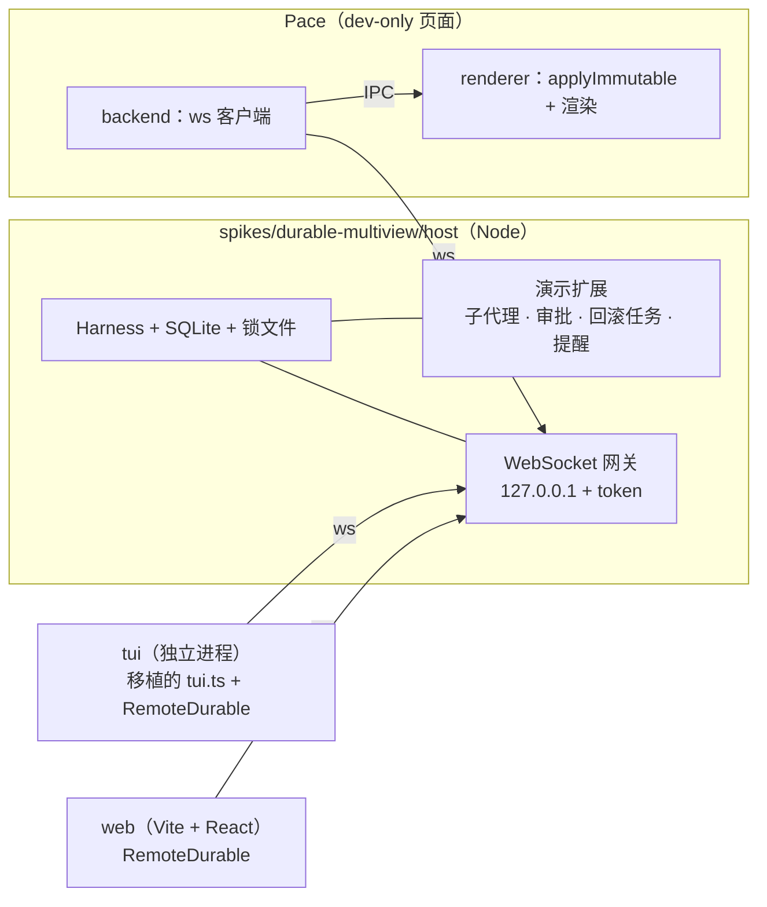

# Handoff：Pi Durable 多端同屏 spike

- 日期：2026-10-02
- 状态：设计已定，未动手。前置的 Pi 1.0 升级在 [PR #425](https://github.com/bubbleptr/pace/pull/425)，合入后从 `origin/main` 开 `feat/durable-multiview-spike`。
- 关联：[docs/research/pi-durable-analysis.md](../../docs/research/pi-durable-analysis.md)（框架分析，用户的写作素材，只在本地工作区，不提交）、[ADR-0040](../../docs/adr/0040-root-session-process-isolation.md)、[ADR-0042](../../docs/adr/0042-pace-as-chord-presentation-host.md)、[ADR-0044](../../docs/adr/0044-single-writer-session-projection-in-renderer.md)
- 目的：把上一个会话里已核实的事实、已定的决策和待决问题交给新会话，避免重查。

## 1. 目标

一个 Durable 宿主进程上跑一个演示任务（包含子代理），三个界面**同时**显示并能驱动它：

1. 服务器上的 TUI（先在本机模拟服务器）；
2. 浏览器里的 Web UI；
3. 本机的 Pace（一个 dev-only 页面）。

演示要尽量把 Durable 的特性都用上（见 §6）。spike 的另一半价值是回答「Pace 将来接入 Durable 需要什么」，最后写成结论文档。

## 2. 已定的决策（用户已确认）

| 问题 | 决定 |
|---|---|
| 本机 GUI | Pace 里加一个 dev-only 页面，连到宿主（不是另做 Electron 壳） |
| 代码位置 | Pace 仓库内（先升级到 Pi 1.0 消除版本冲突，见 PR #425） |
| 模型 | 真模型，走 Pi 的 `ModelRuntime` 与 `~/.pi/agent` 凭据（与 `pi` 共用登录） |
| 服务器 | 先全部在本机跑通，宿主只监听 `127.0.0.1`，以后搬到服务器加 SSH 隧道 |
| TUI | 移植上游 durable 编码 Agent 的 `tui.ts`，接远程版 `DurableView` / `DurableController`，TUI 是独立客户端进程 |

架构上的关键选择：**宿主是一个无界面进程**，独占 Harness 与 SQLite；TUI、Web、Pace 三端地位相同，都是客户端。这样「`kill -9` 宿主 → 三端显示重连 → 重启宿主后三端续上」这一幕才演得出来。

## 3. 已核实的事实

### 3.1 Durable 本身

- 包：`@earendil-works/pi-durable@1.0.0`，依赖 `chord ^1.0.0`、`pi-ai ^1.0.0`、`typebox 1.3.27`、`diff 8.0.4`；`engines.node >= 22.19.0`。本机 Node 是 v25.9.0。**它还不是 Pace 的依赖，spike 要自己加，建议锁精确版本**（README 第一行：API 会无预告变化）。
- 一份存储同一时间只能被一个进程打开，没有跨进程锁（README「Storage」）。上游 durable 编码 Agent 用 `proper-lockfile` 加了锁文件，崩溃留下的锁 10 秒后失效。宿主应照做。
- `Conversation.watch()` 返回 `WatchHandle<ConversationView>`：`value` 是当前值，`start((value, ops, ctx) => Promise<void>)` 每次提交给出 `ops`。慢消费者积压超过 100 帧会被替换为一帧完整视图；重连从当前视图开始，不回放。
- `ops` 的类型是 `@earendil-works/chord/delta` 的 `Op`，纯 JSON 元组（源码注释：「Tuples are the form — in memory, on the wire, on disk」）。客户端用同一模块的 `applyImmutable(target, ops)` 还原，**客户端不需要加载 Harness**。delta 模块对 `__proto__` 路径有防护，客户端务必用它而不是自己写 applier。
- 其他可订阅状态：`harness.taskGraph()` / `watchTaskGraph()`，`harness.documentState(Doc, id)` / `watchDoc()`，`harness.subscribeCommits()`（发现新会话，比如新子代理）。
- 定时器：`TaskRuntime.sleep(until)`，`until` 是绝对时间，要存在输入或检查点里才能跨重启。
- `TaskOptions.background` 只对 `ownership: { kind: "conversation" }` 的任务有效。
- 钩子的 `api`（`HookApi`）只有 `taskId`、`conversationId`、`memo()` 和文档读取（`snapshot`）。**钩子没有 sleep，也拿不到会话句柄**（影响 §8 的审批设计）。

### 3.2 上游参考代码（Pi 仓库 main，MIT）

- 两种子代理示例：[`22-subagent-foreground.ts`](https://github.com/earendil-works/pi/blob/main/packages/durable/test/examples/22-subagent-foreground.ts)（子会话归工具调用所有，`replay: "safe"`，用 `scanConversations({ ownerTaskId })` 找回）和 [`23-subagent-background.ts`](https://github.com/earendil-works/pi/blob/main/packages/durable/test/examples/23-subagent-background.ts)（Anchor + Reporter 两个 background 任务、`app.subagents` 文档、工具 `replay: "unsafe"`）。
- durable 编码 Agent：[`packages/coding-agent/src/experimental/durable/`](https://github.com/earendil-works/pi/tree/main/packages/coding-agent/src/experimental/durable)，文件为 `main.ts`、`runtime.ts`、`tui.ts`（约 25KB）、`subagent.ts`、`harness-setup.ts`、`prompt.ts`、`sessions.ts`。**不在 npm 发布物里**。
- **`runtime.ts` 的接缝就是我们要的客户端契约**：`DurableViewSource { current(); subscribe(listener) }`，`DurableView`（「Plain values; no Harness objects cross this boundary」：`session`、`conversation: ConversationView`、`conversations`、`models`、`notices`、`tasks?: TaskGraph`），`DurableController`（`submit(text, whenBusy)`、`compact`、`abort`、`cycleThinking`、`setModel`、`toggleTasks`、`switchConversation`）。`tui.ts` 只依赖这三样加 `SettingsManager`。README 原话：「Nothing in the TUI handles recovery; it only renders the conversation view.」
- `tui.ts` 用到的 Pi 内部模块，1.0 npm 包（`@earendil-works/pi-coding-agent` 根入口）导出情况：

| 已导出 | 未导出（需要替代） |
|---|---|
| `AssistantMessageComponent`、`ToolExecutionComponent`、`UserMessageComponent`、`CustomEditor`、`DynamicBorder`、`initTheme`、`getMarkdownTheme`、`KeybindingsManager`、`keyText`、`getAgentDir`、`SettingsManager`、`ModelRuntime`、`resolveCliModel` | `createAllToolRenderers`、`WorkingStatusIndicator`、`getEditorTheme`、`InteractiveThemeController`、`formatTokens`、`findInitialModel`、`configureHttpDispatcher`、`applyHttpProxySettings` |

  未导出的可以按文件路径引 `dist/...`（Pace 对 mcp 就是这么做的，见根 `vite.config.ts` 的 `@pace/pi-mcp` 别名），或者拷一份进 spike 并注明出处。

- **HTTP dispatcher 必须配置。** 上游 `harness-setup.ts` 的注释：「pi's HTTP setup: proxy, idle timeouts, and one undici for fetch. Without it, some provider streams break off.」实现在 Pi 的 `src/core/http-dispatcher.ts`（undici 全局 dispatcher、默认空闲超时 300 s、`autoSelectFamilyAttemptTimeout` 2 s、吞掉 undici 的内部 `error` 事件）。Pace 后端里没有对应代码（搜不到 `setGlobalDispatcher`），宿主要自己补。

### 3.3 Pace 侧约束

- **Pace renderer 的 CSP 是 `connect-src 'self'`**（`apps/desktop/index.html`），renderer 不能直连 `ws://127.0.0.1`。两条路：
  - a）（推荐）由 Pace backend（utilityProcess）当 WebSocket 客户端，经现有 IPC 把快照和 ops 转给 renderer，renderer 只做 `applyImmutable` 和渲染。这和 ADR-0042 的「transport 复用进程 IPC」、ADR-0044 的单写者投影一致，也是 spike 要验证的路径。
  - b）只在 dev 下放宽 CSP。改动小，但验证不到 Pace 真实的接入路径。
- 根 `tsconfig.json` 只 include `apps` 和 `packages`；`bun` workspaces 是 `apps/*`、`packages/*`；根 `vitest run` 会收集**整个仓库**的测试文件，默认 jsdom 环境（`vite.config.ts`）。spike 放在 `spikes/durable-multiview/` 时要：把 `spikes/*` 加进 workspaces（依赖走根 lockfile），在根 vitest 的 `exclude` 加 `spikes/**`，spike 用自己的 `tsconfig.json` 和 `vitest.config.ts`（node 环境）。
- AGENTS.md：新增 `shared/ui/` 组件要上 `/design`；dev 页面优先用 Astryx 组件（`bunx astryx build "<idea>"`），不手写 div/hex。
- 宿主跑在 Node 上（Durable 的 SQLite 适配器与 engines 要求），不要用 Bun 运行宿主。

## 4. 架构



建议的目录（新会话可调整）：

```text
spikes/durable-multiview/
  host/        Harness、演示扩展、网关、HTTP dispatcher、锁
  protocol/    帧类型、RemoteDurable（DurableViewSource + DurableController 的远程实现）
  tui/         移植的 tui.ts（保留 MIT 出处）+ main
  web/         Vite + React
  cli/         P0 用的命令行观察器
```

Pace 页面放在 `apps/desktop/src/pages/` 下的 dev-only 路由，backend 侧桥接放 `packages/backend/src/`，用开关隔离，spike 结束可整体删除。

## 5. 网关协议草案

- 流（stream）：`conversation:<id>`（`watch()`）、`tasks`（`watchTaskGraph()`）、`doc:<kind>:<conversationId>`（`watchDoc()`）、`conversations`（由 `subscribeCommits()` 维护的会话列表）、`notices`。
- 服务端 → 客户端：`{ type: "snapshot", stream, value }`、`{ type: "ops", stream, ops }`、`{ type: "result", id, value | error }`。
- 客户端 → 服务端：`{ type: "subscribe" | "unsubscribe", stream }`、`{ type: "call", id, method, args }`。`method` 对齐 `DurableController`，另加 `fork`、`configure`、`approve`、`reset`。
- 重连：重新 `subscribe`，拿新快照；客户端不做历史回放。
- 鉴权：启动时生成 token，客户端连接时带上；只监听 `127.0.0.1`。
- 背压：服务端每个客户端一个发送队列；依赖 `watch()` 自带的 100 帧折叠。

## 6. 演示剧本与特性覆盖

场景：值班 Agent 调查「v2.3 发布失败」。**所有工具都是模拟的，不装 `CodingTools`/bash**：任何客户端都能驱动 Agent，工具又在宿主机上执行。

| 步骤 | Durable 特性 | 三端看到 |
|---|---|---|
| 1. 提问，主 Agent 写调查计划到待办 | 文档（同提交） | 待办实时同步 |
| 2. 并行派 3 个前台子代理（日志 / 指标 / 提交历史） | 所有权树、并行工具、`api.output`、`details` 挂载 | 任务图，子代理挂在调用下 |
| 3. 调查中途 `kill -9` 宿主，再重启 | 检查点恢复、`replay: "safe"` 只重跑未完成、`requestId` 找回子代理 | 三端断线 → 续上 |
| 4. TUI steer，网页排 follow-up | inbox 语义 | 队列三端可见 |
| 5. Pace 里切到某个子代理并直接 steer | 子会话即普通会话 | 任一端驱动任一会话 |
| 6. 提出回滚，触发审批钩子 | `beforeTool` + memo（先写者胜） | 三端同时弹审批，先点的生效；审批后崩溃不再问 |
| 7. 回滚为自定义任务，3 个区域并行，一个失败 | `defineTask`、`waiting` + `failFast`、自下而上 abort 补偿 | 任务图里兄弟节点被中止、补偿 |
| 8. Esc；「60 秒后复查」提醒照样触发 | background 边界、`runtime.sleep` | 提醒以 follow-up 出现 |
| 9. 网页在某条消息处 fork「写复盘」并去掉回滚工具 | fork、按会话配置工具、文档 fork 语义 | 会话列表多一个分支 |
| 10. Pace 发起手动压缩 | 压缩是任务，不打断对话 | 压缩状态三端可见 |
| 11. 改扩展文件，宿主热替换 | Registry 原地替换 | 下一次工具输出格式变化 |
| 12. 用量面板 | `pi.usage` | 用量 |

覆盖不到：自定义存储后端、Bun / Durable Object 运行、提示缓存差量、任务版本迁移。

真模型的代价：子代理不一定按剧本派出，崩溃时机也要看着任务图手动掐。用子代理工具的描述和会话 `instructions` 把流程写死一些；工具输出用 `api.output` 慢速流出，给崩溃演示留时间窗。

## 7. 分阶段与验收

| 阶段 | 内容 | 验收 |
|---|---|---|
| P0 | 宿主（锁、HTTP dispatcher、ModelRuntime、最小扩展）、网关、`protocol` 的 RemoteDurable、命令行观察器 | 两个观察器看到同一段流式输出；`kill -9` 宿主再重启，两端自动续上且转录一致 |
| P1 | 移植 TUI | TUI 作为远程客户端完成提问、steer、abort、切会话、任务面板 |
| P2 | Web UI | 与 TUI 同时连接，状态一致 |
| P3 | Pace dev 页面（backend ws 客户端 + IPC + renderer 投影） | 三端同屏 |
| P4 | 演示扩展与剧本（§6） | 剧本能完整走一遍，崩溃与热替换各演示一次 |
| P5 | `docs/research/` 结论文档 | 回答：Pace 接入 Durable 的传输、投影、子代理呈现、进程模型各需要什么，与 ADR-0040/0042/0044 的冲突点 |

每个阶段先写失败测试（宿主与协议用 vitest node 环境；网关可以用真 WebSocket 起本地端口测）。

## 8. 待决问题

1. **审批钩子怎么等人点。** `HookApi` 没有 sleep，也没有会话句柄。候选：
   - a）钩子里用普通 `setTimeout` 轮询 `snapshot(ApprovalsDoc)`，拿到结果立刻写 memo。轮询本身不持久，但重启后钩子重跑，会先读 memo，所以语义正确。
   - b）不用钩子，做成工具：`request_approval` 创建一个 Approval 任务，任务用 `runtime.sleep` 轮询文档并持久等待，`rollback` 工具检查审批结果。
   
   建议先试 a），不顺再换 b）。客户端点击走网关的 `approve` 调用，由宿主提交到 `ApprovalsDoc`。
2. **Pace 页面走 §3.3 的 a）还是 b）。** 推荐 a）。
3. **`tui.ts` 缺失导出的替代**：按路径引 `dist` 还是拷贝。前者随 Pi 升级自动跟进但可能断，后者稳定但要注明出处。
4. **子代理用前台还是后台写法**：剧本步骤 2 用前台（示例 22）；如果想演示「主 Agent 不被阻塞、子代理跨轮常驻」，再加一个后台子代理（示例 23）。
5. 真模型用哪个 provider：读 `~/.pi/agent/settings.json` 的默认模型即可，宿主启动时打印出来。

## 9. 新会话的起步步骤

1. 确认 PR #425 已合入；在主检出上 `git checkout main && git pull`，删掉本地 `chore/upgrade-pi-1.0`。
2. `git fetch && git checkout -b feat/durable-multiview-spike origin/main`。
3. 只把本文件提交进该分支。`docs/research/` 下的 `pi-durable-analysis.md`、`pi-durable-evidence.md`、`pi-durable-visual-guide.md` 是用户写文章的素材，留在工作区、**不提交**，`git add` 时不要用 `-A` 或 `.`。
4. 读上游 `runtime.ts`、`tui.ts`、`harness-setup.ts`、示例 22/23（链接见 §3.2）。本机有 1.0.0 的 tarball 解包可直接对照：`/private/tmp/pi1/`（`pi-durable`、`pi-coding-agent`、`chord`）。
5. 按 §7 从 P0 开始，先定 workspace / vitest / tsconfig 的接入方式（§3.3）。
