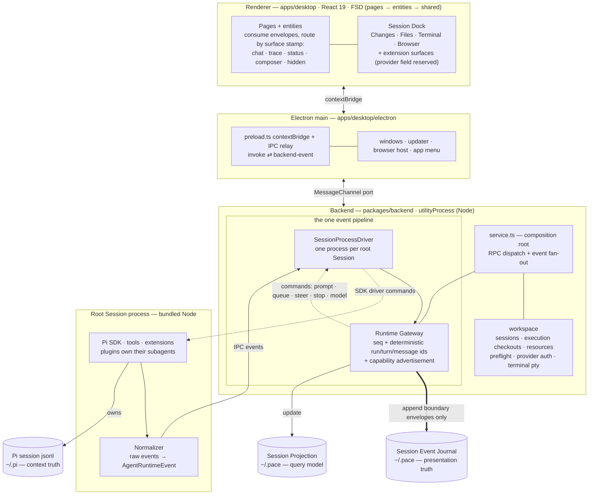

<p align="center">
  
</p>
<h1 align="center">Pace</h1>
<p align="center">The desktop GUI for the <a href="https://pi.dev">Pi coding agent</a>. Pi's design and flexibility, carried to the desktop.</p>

<p align="center">English | <a href="README.zh-CN.md">简体中文</a></p>

<p align="center">
  <a href="https://github.com/BubblePtr/pace/releases/latest"></a>
  <a href="https://github.com/BubblePtr/pace/releases/latest"></a>
  <a href="https://github.com/BubblePtr/pace/actions"></a>
</p>

Pi is a coding agent that runs in the terminal, with a highly extensible system in the spirit of VS Code: packages contribute tools, commands, skills, prompts and themes. We want to bring that flexibility to a desktop application, so that developers can freely shape a desktop agent that is truly their own. The name comes from *move at your own pace*: in the age of AI, developers should keep full ownership of their agent, and set their own rhythm for how they build and collaborate.

> [!NOTE]
> Pace is in early `0.y.z` development. Only the latest version on GitHub Releases is supported. Journal and projection formats may change between minor versions; the in-app updater handles upgrades. Pi's session data is unaffected (see [Local data and recovery](#local-data-and-recovery)).

<p align="center">
  
</p>

## Highlights

- **Session timeline**: follow the agent's chain of thought and tool calls in order, alongside token usage and cost for each turn. Watch execution live or replay recorded sessions to see what happened at each step and what it cost.
- **Session Dock panels**: Changes, Files, Terminal and the embedded Browser share one sidebar. Pi extensions can also contribute their own panels.
- **A consistent, customizable interface**: [Astryx](https://github.com/facebook/astryx) components and open design tokens give built-in views and custom components shared colors, spacing and interaction conventions. Astryx's component styles are precompiled by [StyleX](https://engineering.fb.com/2025/11/11/web/stylex-a-styling-library-for-css-at-scale/) into reusable atomic CSS, reducing duplicate rules without generating stylesheets at runtime. Developers and agents can use the Astryx CLI to look up components and choose templates, following the same design conventions when building new views.
- **Pi remains the only engine**: Pace is not a fork of Pi or a separate runtime. Pi's local logs remain the source of truth for sessions; uninstalling Pace does not delete Pi sessions.

## Quick start

### Install

**Prebuilt installers (recommended).** Signed and notarized installers for Apple Silicon Macs are available on [GitHub Releases](https://github.com/BubblePtr/pace/releases). Open the downloaded DMG and drag Pace into Applications. Subsequent updates are available in the app (ADR-0033).

**Run from source.** Requires Bun 1.3.x and Node 24:

```bash
git clone https://github.com/BubblePtr/pace.git pace
cd pace
bun install
bun run dev
```

**Requirements.** An Apple Silicon Mac running macOS 12 or later. The Pi runtime is bundled with the app (ADR-0031), so no separate `pi` install is needed. If Pi is already installed, Pace shares the sessions, auth configuration and extensions under `~/.pi/agent`. Linux AppImage and deb packaging scripts are available but have not shipped as official releases; Windows is not supported yet.

### Start your first session

1. On first launch, Pace checks the bundled Pi runtime, data directory and model provider login status, and shows where data will be saved (ADR-0025). If you have not signed in to a model provider, you can do so through `pi` in the terminal. Pace detects the new login state without a restart.
2. After preflight passes, select a project directory and create a session.
3. Send your first message, such as asking the agent to explain the repository's structure.
4. Read the conversation in Live Chat, inspect the chain of thought and tool calls in Trajectory, and check the turn's token usage and cost in the status bar.

## When Pace is not a fit

- You use Pi in the terminal and do not need a graphical view of costs, chain of thought or tool calls.
- You use Windows or an Intel Mac. Installers are currently available only for Apple Silicon Macs.
- You want a standalone agent client that does not depend on Pi. Pace does not implement an agent loop; Pi handles inference and context management.

## Design principles

- **Pace is a projection of session events; it never intrudes on the core context.** Pi's local session log (`~/.pi`) is the single source of truth, and Pi is always the real host of the session and its context. On resume, Pi rebuilds the LLM context from that log on its own. Pace never assembles a prompt and never modifies that log. Everything Pace persists is only a projection of Pi's event stream, kept in Pace's own directory.

- **The UI is driven entirely by the event journal.** Every raw event Pi emits is normalized into an `AgentRuntimeEvent`, assigned a monotonically increasing sequence number and deterministic run / turn / message ids, and persisted to a journal. The live timeline, history replay, and token and cost accounting are all derived from that journal, never from volatile renderer state.

- **Panels and behavior are decoupled from the client, and both can come from extensions.** The Pace client itself ships only a small set of core panels (Surfaces). The underlying event routing, the Session Dock registry and the Runtime Gateway capability model all follow a plugin-oriented design: a Pi extension can register its own panels, controls or workflow visualizations without waiting for a Pace release. This follows the same "everything is a plugin" idea as [DeepSeek Harness](https://github.com/deepseek-ai/deepseek-harness); as their plugin model matures, Pace intends to borrow from it heavily.

- **Monitoring and interaction never block the engine.** The backend runs in a separate Electron `utilityProcess`: heavy log parsing and driver crashes cannot make the GUI window stutter or hang. The backend protocol is decoupled from any specific transport, so it can later move behind a remote socket service without a rewrite.

## Architecture

The whole system is one unidirectional event pipeline plus two persistence tracks whose roles never swap ([ADR-0021](docs/adr/0021-session-fork-resume-persistence-layering.md)):



- **Driver**: `SessionProcessDriver` gives every root Session its own process and working directory. Each process hosts the Pi SDK driver; plugins own their child Sessions ([ADR-0040](docs/adr/0040-root-session-process-isolation.md)). The SDK driver is the only Pi driver; the earlier CLI RPC driver was removed ([ADR-0041](docs/adr/0041-remove-pi-rpc-driver.md)).

- **Normalizer**: converts the raw events Pi emits into a unified `AgentRuntimeEvent`, attaching a phase, a target surface and globally deterministic message ids ([ADR-0020](docs/adr/0020-agent-runtime-event-model.md)). The recorded fixture contract tests are the executable spec of this protocol.

- **Runtime Gateway**: the only protocol interface the renderer talks to. Control commands go up; sequenced envelopes with monotonically increasing sequence numbers come down. The gateway dynamically advertises the capabilities of the current runtime (model switching, thinking controls, queueing and steering), so the UI follows what the runtime actually supports instead of static assumptions ([ADR-0024](docs/adr/0024-model-thinking-controls-follow-runtime-capabilities.md)).

- **Persistence**: maintains the Session Event Journal (append-only, replayable as a timeline) and the Session Projection (a query model for fast list rendering and state statistics).

- **Renderer**: routes each event by its `surface` stamp into Live Chat, the Trajectory (chain of thought and tool calls), the status bar or hidden background state. It also hosts the Session Dock sidebar, where both built-in and extension-contributed panels are mounted ([ADR-0032](docs/adr/0032-session-dock-and-trajectory-vocabulary.md)).

### How a prompt flows

1. The renderer issues a `send_prompt` request through the Runtime Gateway client (`apps/desktop/src/entities/runtime/runtime-gateway-client.ts`).

2. The command crosses the MessagePort channel into the backend `utilityProcess` (`apps/desktop/electron/preload.ts`, `backend.ts`).

3. `createBackendService()` dispatches it to the Runtime Gateway instance (`packages/backend/src/service.ts`).

4. The Gateway assigns a globally deterministic user message id and forwards the command to the active driver (`packages/backend/src/gateway/runtime-gateway.ts`).

5. The process driver forwards the command to that Session's worker, where the SDK driver calls Pi's `AgentSession` (`packages/backend/src/drivers/session-process-driver.ts`, `pi-sdk-driver.ts`).

6. The worker's Normalizer converts Pi events into the standard format and sends them back over IPC (`packages/backend/src/gateway/agent-runtime-event-normalizer.ts`).

7. The Gateway stamps each event with a monotonically increasing sequence number, records lifecycle boundaries and updates the projection (`packages/backend/src/persistence/`).

8. Events stream back over the same transport, and the renderer routes each one to its UI component by its `surface` stamp (`apps/desktop/src/entities/runtime/`).

### Where things live

| To change… | Go to… |
| --- | --- |
| UI, pages, interactions | [`apps/desktop/src/`](apps/desktop/src/), FSD layers `pages` → `entities` → `shared` ([ADR-0016](docs/adr/0016-fsd-layers-in-apps-desktop.md)) |
| Event semantics (what counts as a message / run / turn) | [`packages/backend/src/gateway/agent-runtime-event-normalizer.ts`](packages/backend/src/gateway/) and its fixture tests |
| Gateway protocol (commands, event contract, identity) | [`packages/core/src/`](packages/core/src/): `runtime-gateway.ts`, `agent-runtime-event.ts` |
| How Pi is driven | [`packages/backend/src/drivers/`](packages/backend/src/drivers/) |
| Persistence and replay | [`packages/backend/src/persistence/`](packages/backend/src/persistence/) |
| Packages page (sidebar): packages, resources, update checks and journal diagnostics | [`apps/desktop/src/pages/setup.tsx`](apps/desktop/src/pages/setup.tsx), [`packages/backend/src/workspace/resource-management.ts`](packages/backend/src/workspace/resource-management.ts), [`resource-diagnostics.ts`](packages/backend/src/workspace/resource-diagnostics.ts) ([ADR-0037](docs/adr/0037-resource-management.md)) |
| Model availability (catalog, capability mapping, credential-driven refresh) | [`packages/backend/src/workspace/model-catalog.ts`](packages/backend/src/workspace/model-catalog.ts), mapping in [`packages/core/src/model-capabilities.ts`](packages/core/src/model-capabilities.ts) ([ADR-0043](docs/adr/0043-model-catalog-owns-model-availability.md)) |
| Sessions on disk, git worktrees, config inventory | [`packages/backend/src/workspace/`](packages/backend/src/workspace/) |
| Electron shell and transport | [`apps/desktop/electron/`](apps/desktop/electron/): `main.ts`, `preload.ts`, `backend.ts` |
| Dock surfaces (Changes, Files, Terminal, Browser) | [`apps/desktop/src/shared/ui/session-dock/surface-registry.ts`](apps/desktop/src/shared/ui/session-dock/surface-registry.ts) |
| Design system rules | [`docs/design/`](docs/design/), inventory of self-built components in [`docs/self-built-ui.md`](docs/self-built-ui.md) |
| Why it is designed this way | [`docs/adr/`](docs/adr/), vocabulary in [`CONTEXT.md`](CONTEXT.md) |

## Extensibility: where the GUI meets Pi's extension ecosystem

Pi's extension ecosystem is built on the `Package → Extension / Skill / Prompt / Theme` model. Pace follows and reuses that model as is; it only defines what an extension can contribute to the desktop GUI in terms of visuals and interaction. The **Packages** page in the sidebar provides Resource Management: install, remove and update user packages, toggle their resources, and add local resources to Pi convention directories. Package rows show available updates; resource details show extension errors from the most recently active Session. Settings changes apply to the next new Session ([ADR-0037](docs/adr/0037-resource-management.md)).

The extension points that exist today:

- **The `surface` routing stamp on every event**: the `chat | trace | status | composer | hidden` stamp an event carries decides how it is presented in the UI. Today it is a fixed, predefined set; it is also the standard mounting slot for future extension panels.

- **The Session Dock panel registry**: every interactive panel in the Session Dock sidebar is a Surface with a unique id, title, icon and hint, declared centrally in `surface-registry.ts`. The registry currently holds four built-in panels (Changes, Files, Terminal and the embedded Browser). Per [ADR-0032](docs/adr/0032-session-dock-and-trajectory-vocabulary.md), the registry already reserves a `provider` field (`builtin` or a specific Pi extension id), so panels contributed by external extensions mount into the same sidebar with no extra mechanism.

- **The Runtime Gateway capability model**: the UI adapts to the features the current runtime advertises. For Pi SDK "extension UI requests", the gateway already reserves a slot at the protocol level ([ADR-0018](docs/adr/0018-runtime-gateway-api-and-pi-drivers.md)); support will be filled in step by step.

The roadmap on this track, in priority order:

1. **Extension Surface protocol**: a standardized protocol that lets a Pi extension register a custom panel fed directly by the same underlying event stream.

2. **Multi-agent dynamic workflow visualization**: when Pi runs multi-step tasks or coordinates multiple agents, render the work as a clear execution topology instead of interleaved text logs.

3. **Pluggable runtime tuning**: open up the controls in Pace that shape agent behavior (prompt injection, permission management, interruption policy and so on) as extension points, so developers can customize agent behavior by installing a package rather than modifying the client repository.

Alongside this, Pace aims to deliver the GUI-native experience a terminal cannot host: an embedded browser with DOM-level annotation and interaction ([ADR-0029](docs/adr/0029-embedded-browser-surface.md)). That is also the core reason Pace is built on Electron.

## Repository layout

```plaintext
apps/desktop/        Electron app: electron/ (main, preload, backend host) + src/ (React, FSD)
apps/server/         placeholder: headless backend behind a WebSocket (ADR-0015)
apps/web/            placeholder: browser client for apps/server
packages/core/       shared kernel: gateway protocol, event model, session types (ADR-0014)
packages/backend/    drivers, gateway, persistence, workspace; service.ts is the composition root
e2e/                 Playwright smoke tests against the real Electron app
build/               icons, entitlements, Icon Composer source
scripts/             release, packaging and runtime-bundling scripts
docs/                ADRs, design system rules, release and dogfooding guides
CONTEXT.md           the domain glossary; every UI region and concept has a term here
```

Stack: Electron + electron-vite, React 19, TypeScript, TanStack (Query / Router / Virtual), the Astryx design system (component styles precompiled by StyleX) and Tailwind v4, Bun workspaces, Vitest, Playwright.

## Local data and recovery

| Data | Installed app | `bun run dev` | Owner |
| --- | --- | --- | --- |
| Pi sessions, auth, extensions | `~/.pi/agent` | shared | Pi owns session truth; Pace manages user resource settings through the SDK and imports local resources. |
| Session journal, projections, preflight state | `~/.pace` | `~/.pace-dev` | Pace. Override with `PACE_DATA_DIR` (`PIGUI_DATA_DIR` is a deprecated alias). |
| Renderer preferences (project registry, drafts, model choice), Chromium profile | Electron userData | userData `-dev` | Pace. |

Deleting Pace's local data directory only loses the UI history and cost statistics. It never damages the underlying Pi session data: Pi can fully rebuild its state from its own session log at any time. Any later change to the journal or projection storage format must stay backward compatible with the old format or ship a migration script (see [`docs/dogfooding.md`](docs/dogfooding.md)).

## Development and verification

Toolchain: Bun 1.3.x (workspaces and scripts), Node 24 (Electron's runtime and Vitest), Electron 42. `bun run dev` starts electron-vite with hot reload. The dev instance writes to `~/.pace-dev` and a userData directory with a `-dev` suffix, keeping installed-app data separate. See [`docs/dogfooding.md`](docs/dogfooding.md) for the isolation rules when developing Pace with Pace.

```bash
bun run typecheck        # tsc --noEmit across the workspace
bun run test             # vitest: unit + contract tests (normalizer fixtures, gateway, persistence)
bun run test:e2e         # Playwright smoke tests against the dev Electron build
bun run test:release     # release script and publish behavior tests
bun run build            # typecheck + electron-vite build
```

Before opening a PR, `typecheck`, `test` and `build` must be green; the manual `Validate macOS ARM64` workflow runs packaging and the packaged-app E2E on demand.

Packaging:

```bash
bun run package:mac:unsigned   # unsigned .app + zip, for local testing
bun run dist:mac               # signed + notarized DMG (needs Apple credentials)
bun run dist:linux             # AppImage + deb (x64)
```

The signing, notarization and release pipeline is documented in [`docs/release/macos.md`](docs/release/macos.md).

Two dev-only tools help when working on the UI locally:

- The `/design` route: a live gallery of the design system, showing every base component under `shared/ui/` with all of its states and variants.

- The **UI Intent Picker**: press `Cmd/Ctrl+Shift+X` to activate a crosshair, then click any element to copy its CONTEXT.md term, its component stack with file and line, and the nearest `data-testid` (see [`docs/ui-intent-picker.md`](docs/ui-intent-picker.md)).

> **Note**: do not debug the terminal PTY driver directly under Bun. The production backend runs on Node, and Bun's current Node-API compatibility layer can crash `node-pty`.

## Documentation

- [`CONTEXT.md`](CONTEXT.md): domain glossary. The terms here are the names used in code, tests and issues.

- [`docs/adr/`](docs/adr/): architecture decision records, from the control-plane pivot ([ADR-0001](docs/adr/0001-agent-workspace-control-plane.md)) to the current surfaces.

- [`docs/design/`](docs/design/): which tokens, which Astryx variants, which self-built components.

- [`docs/release/macos.md`](docs/release/macos.md), [`docs/dogfooding.md`](docs/dogfooding.md): shipping and daily-driving Pace.

- [`docs/agents/`](docs/agents/): how issues, triage labels and domain docs are organized for both human and agent contributors.

- [`.scratch/<feature>/PRD.md`](.scratch/): point-in-time product requirement records.

## Support and security

- **Bugs and feature requests**: submit them to [GitHub Issues](https://github.com/BubblePtr/pace/issues).
- **Security vulnerabilities**: do not open a public issue. Follow [SECURITY.md](SECURITY.md) to report vulnerabilities privately through GitHub. Only the latest release is supported.
- **Release notes**: see [GitHub Releases](https://github.com/BubblePtr/pace/releases) for changes in each version.

## Contributing

- **Issues**: tasks and bugs are tracked on GitHub Issues. Labels follow a role-based triage flow (`needs-triage`, `needs-info`, `ready-for-agent`, `ready-for-human`, `wontfix`); anything marked `ready-for-human` is open for community members to pick up.

- **Branches and commits**: features and fixes are developed on `feat/`, `fix/` and `chore/` branches; `main` is the only long-lived branch, and releases are cut from git tags. Dependent PRs should be managed with `gh stack`. Commit messages strictly follow Conventional Commits.

- **Architecture decision records**: any change that moves an architectural boundary or adjusts a key domain term ships with an ADR; if it touches concept definitions, update `CONTEXT.md` in the same PR.

- **UI components**: reusable components go in `apps/desktop/src/shared/ui/` and are added to the `/design` gallery in the same PR. Style tokens come through the semantic bridge layer; hard-coded values are not allowed.

- **Good first issue**: a recommended entry point is adding a fixture test for the event Normalizer: record a raw Pi session log, add a test case and assert the normalized events. It needs no UI work and is a fast way to learn the core protocol.

See [CONTRIBUTING.md](CONTRIBUTING.md), [CODE_OF_CONDUCT.md](CODE_OF_CONDUCT.md) and [SECURITY.md](SECURITY.md). [`AGENTS.md`](AGENTS.md) holds the full contributor rules, written to be followed by humans and coding agents alike.

## License

Pace is released under the [Apache License 2.0](LICENSE). The Pace name and icon are not covered by that grant. Pi is a separate project with its own license.
