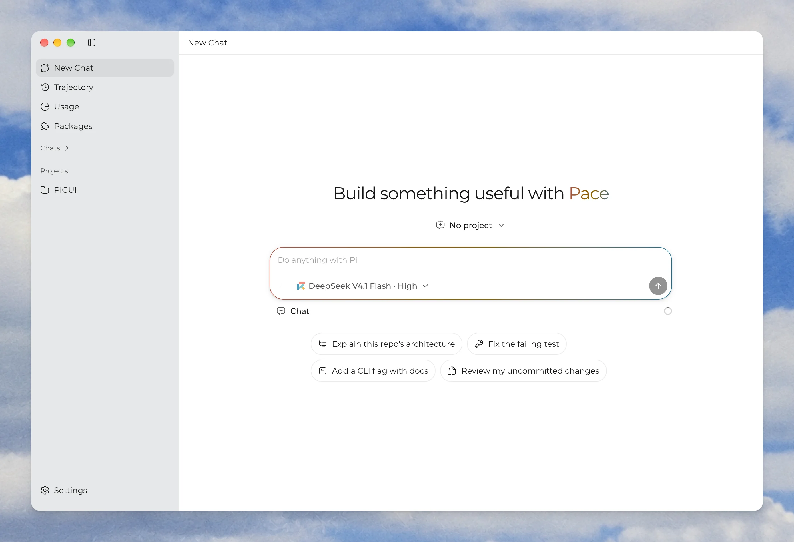
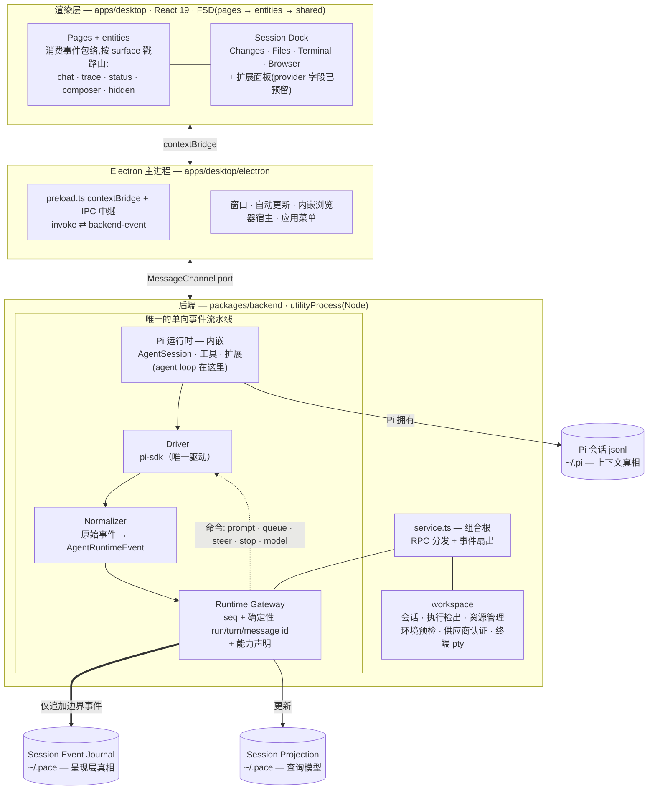

<p align="center">
  
</p>
<h1 align="center">Pace</h1>
<p align="center"><a href="https://pi.dev">Pi coding agent</a> 的桌面 GUI。将 Pi 的设计与灵活性带到桌面端。</p>

<p align="center"><a href="README.md">English</a> | 简体中文</p>

<p align="center">
  <a href="https://github.com/BubblePtr/pace/releases/latest"></a>
  <a href="https://github.com/BubblePtr/pace/releases/latest"></a>
  <a href="LICENSE"></a>
</p>

Pi 是运行在终端里的编程智能体，拥有类似 VS Code 的扩展体系：扩展包可以提供工具、命令、技能、提示词和主题。Pace 将这份灵活性带到桌面端，让开发者自由定制属于自己的智能体。Pace 的名字取自 *move at your own pace*，意为“按自己的节奏前进”。在 AI 时代，开发者也应当保有对智能体的完全自主权，按自己的节奏开发与协作。

> [!NOTE]
> Pace 处于 `0.y.z` 早期阶段，仅支持 GitHub Releases 上的最新版本。事件日志（journal）与查询投影（projection）的存储格式可能随次版本更新而变化，应用内更新器负责完成升级；Pi 的会话数据不受影响（见[本地数据与恢复](#本地数据与恢复)）。

<p align="center">
  
</p>

## 亮点

- **会话时间线**：按时间查看智能体的思维链和工具调用，以及每轮的 Token 用量与费用。既能实时跟进执行过程，也能回放已记录的会话，查看每一步做了什么、花了多少。
- **Session Dock 面板**：代码变更（Changes）、文件（Files）、终端（Terminal）、内嵌浏览器（Browser）集中在同一个侧边栏，Pi 扩展也可以提供自己的面板。
- **统一且可定制的界面**：基于 [Astryx](https://github.com/facebook/astryx) 的组件与开放设计变量，让内置界面和自定义组件共享配色、间距与交互规范。Astryx 的组件样式由 [StyleX](https://engineering.fb.com/2025/11/11/web/stylex-a-styling-library-for-css-at-scale/) 预编译为可复用的原子 CSS，减少重复样式，无需在运行时动态生成样式表。开发者和智能体还可以通过 Astryx CLI 查阅组件、选用模板，沿用同一套设计规范构建新界面。
- **Pi 仍是唯一引擎**：Pace 不是 Pi 的分支项目，也不是另一套独立运行时。会话数据以 Pi 的本地日志为准，卸载 Pace 不会丢失 Pi 的会话。

## 快速开始

### 安装

**预编译安装包（推荐）。** 适用于 Apple Silicon Mac 的安装包已完成签名和公证，发布在 [GitHub Releases](https://github.com/BubblePtr/pace/releases)。下载并打开 DMG，将 Pace 拖入“应用程序”文件夹即可。后续可在应用内更新（ADR-0033）。

**从源码运行。** 需要 Bun 1.3.x 与 Node 24：

```bash
git clone https://github.com/BubblePtr/pace.git pace
cd pace
bun install
bun run dev
```

**运行要求。** 搭载 Apple Silicon 芯片的 Mac，运行 macOS 12 或更高版本。Pi 运行时已随应用内置（ADR-0031），无需单独安装 `pi`；若本机已装 Pi，Pace 会共享 `~/.pi/agent` 下的会话、认证与扩展。Linux 的 AppImage 与 deb 打包脚本已就绪但尚未正式发布；暂不支持 Windows。

### 开始第一次会话

1. 首次启动时，Pace 会检查内置 Pi 运行时、数据目录和模型服务商的登录状态，并显示数据的保存位置（ADR-0025）。如果尚未登录模型服务商，可在终端中通过 `pi` 完成登录。Pace 会自动识别新的登录状态，无需重启。
2. 预检通过后，选择一个项目目录，新建会话。
3. 在输入框中发送第一条消息，比如让它解释这个仓库的结构。
4. 在 Live Chat 中查看对话，在 Trajectory 中查看思维链和工具调用，在状态栏中查看本轮的 Token 用量与费用。

## 什么时候不需要 Pace

- 你只在终端里用 Pi，不需要通过图形界面查看费用、思维链或工具调用。
- 你使用 Windows 电脑或 Intel Mac。目前仅提供适用于 Apple Silicon Mac 的安装包。
- 你想要一个不依赖 Pi 的独立智能体客户端。Pace 不实现智能体的执行循环，推理执行与上下文管理均由 Pi 负责。

## 设计原则

- **Pace 只是会话事件的投影，不侵入核心上下文。** Pi 的本地会话日志（`~/.pi`）是唯一事实来源，会话恢复时由 Pi 自己从中重建大模型上下文。Pace 不组装提示词，也不修改该日志；Pace 持久化的所有数据都是 Pi 事件流的投影，存放在自己的目录里。
- **界面完全由事件日志驱动。** Pi 的每个原始事件都被标准化为 `AgentRuntimeEvent`，分配单调递增的序号和按确定性规则生成的 run / turn / message ID，然后写入事件日志。实时时间线、历史回放、Token 用量与费用统计均由事件日志推导，不依赖前端渲染状态。
- **面板和行为均与客户端解耦，都可以由扩展提供。** Pace 自身只内置少量核心面板（Surface）。事件路由、Session Dock 注册表和 Runtime Gateway 能力模型均采用插件化设计，Pi 扩展无需等待 Pace 发布新版本，就能注册自定义面板、控件或工作流视图。这与 [DeepSeek Harness](https://github.com/deepseek-ai/deepseek-harness) 的“一切皆插件”思路一致；随着其插件模型逐步成熟，Pace 计划借鉴其中的设计。
- **监控与交互不阻塞执行引擎。** 后端运行在 Electron 的独立进程 `utilityProcess` 中，繁重的日志解析和驱动崩溃都不会让窗口卡顿。后端协议与具体传输方式解耦，将来可将后端部署为通过 socket 连接的远程服务。

## 架构

整个系统由一条单向事件流水线和两套职责明确、互不替代的持久化机制组成（[ADR-0021](docs/adr/0021-session-fork-resume-persistence-layering.md)）：



- **Driver（驱动层）**：封装 Pi 运行时。SDK Driver 是唯一的 Pi 驱动，运行在每个根 Session 的独立进程中（[ADR-0040](docs/adr/0040-root-session-process-isolation.md)）；早期的 RPC Driver 已删除（[ADR-0041](docs/adr/0041-remove-pi-rpc-driver.md)）。
- **Normalizer（标准化层）**：把 Pi 的原始事件转换为统一的 `AgentRuntimeEvent`，附加阶段（Phase）、目标展示区（Surface）和按确定性规则生成的消息 ID（[ADR-0020](docs/adr/0020-agent-runtime-event-model.md)）。基于录制数据的契约测试构成了该协议的可执行规范。
- **Runtime Gateway（运行时网关）**：渲染层与后端通信的唯一协议接口。接收渲染层发来的控制命令，并向渲染层推送带单调递增序号的事件封装（envelope）。网关声明当前运行时支持的能力，包括模型切换、思考设置、消息排队与执行引导，界面据此提供相应的操作（[ADR-0024](docs/adr/0024-model-thinking-controls-follow-runtime-capabilities.md)）。
- **Persistence（持久化层）**：维护仅追加、可按时间线回放的 Session Event Journal，以及供列表和统计查询的 Session Projection。
- **Renderer（渲染层）**：根据 `surface` 标签，将事件分发到实时对话（Live Chat）、执行轨迹（Trajectory）、状态栏或不直接显示的后台状态；同时承载 Session Dock 侧边栏，挂载内置面板和扩展提供的面板（[ADR-0032](docs/adr/0032-session-dock-and-trajectory-vocabulary.md)）。

<details>
<summary>一条消息的处理流程</summary>

1. 渲染层通过 Runtime Gateway Client 发送 `send_prompt` 请求（`apps/desktop/src/entities/runtime/runtime-gateway-client.ts`）。
2. 命令经 MessagePort 跨进程通道转发至后端 `utilityProcess`（`apps/desktop/electron/preload.ts`、`backend.ts`）。
3. `createBackendService()` 将命令分发至 Runtime Gateway 实例（`packages/backend/src/service.ts`）。
4. Gateway 按确定性规则生成用户消息 ID，并将命令转发给当前启用的 Driver（`packages/backend/src/gateway/runtime-gateway.ts`）。
5. SDK Driver 调用 Pi 的 `AgentSession`，驱动智能体的执行循环（`packages/backend/src/drivers/pi-sdk-driver.ts`）。
6. Pi 的原始事件经 Normalizer 转换为标准格式（`packages/backend/src/gateway/agent-runtime-event-normalizer.ts`）。
7. Gateway 为每个事件赋予单调递增序号，记录生命周期边界，同步更新投影（`packages/backend/src/persistence/`）。
8. 事件经同一传输通道返回渲染层，按 `surface` 标签路由到对应界面组件（`apps/desktop/src/entities/runtime/`）。

</details>

<details>
<summary>代码在哪里</summary>

| 修改内容 | 对应位置 |
| --- | --- |
| 界面、页面、交互 | [`apps/desktop/src/`](apps/desktop/src/)，FSD 分层 `pages` → `entities` → `shared`（[ADR-0016](docs/adr/0016-fsd-layers-in-apps-desktop.md)） |
| 事件语义（什么算 message / run / turn） | [`packages/backend/src/gateway/agent-runtime-event-normalizer.ts`](packages/backend/src/gateway/) 及其基于录制数据的测试 |
| Gateway 协议（命令、事件契约、身份） | [`packages/core/src/`](packages/core/src/)：`runtime-gateway.ts`、`agent-runtime-event.ts` |
| 怎么驱动 Pi | [`packages/backend/src/drivers/`](packages/backend/src/drivers/) |
| 持久化与回放 | [`packages/backend/src/persistence/`](packages/backend/src/persistence/) |
| 磁盘上的会话、Git 工作树和配置清单 | [`packages/backend/src/workspace/`](packages/backend/src/workspace/) |
| Electron 外壳与传输 | [`apps/desktop/electron/`](apps/desktop/electron/)：`main.ts`、`preload.ts`、`backend.ts` |
| Dock Surface（Changes、Files、Terminal、Browser） | [`apps/desktop/src/shared/ui/session-dock/surface-registry.ts`](apps/desktop/src/shared/ui/session-dock/surface-registry.ts) |
| 资源管理（侧边栏的 Packages 页）：扩展包、资源、更新检查与事件日志诊断 | [`apps/desktop/src/pages/setup.tsx`](apps/desktop/src/pages/setup.tsx)、[`packages/backend/src/workspace/resource-management.ts`](packages/backend/src/workspace/resource-management.ts)、[`resource-diagnostics.ts`](packages/backend/src/workspace/resource-diagnostics.ts)（[ADR-0037](docs/adr/0037-resource-management.md)） |
| 设计系统规则 | [`docs/design/`](docs/design/)，自建组件清单见 [`docs/self-built-ui.md`](docs/self-built-ui.md) |
| 为什么这样设计 | [`docs/adr/`](docs/adr/)，术语在 [`CONTEXT.md`](CONTEXT.md) |

</details>

## 扩展机制：将 Pi 扩展接入桌面界面

Pi 的扩展生态基于 `Package → Extension / Skill / Prompt / Theme` 体系。Pace 直接复用这一模型，并定义扩展可以为桌面界面提供哪些展示与交互能力。

主侧边栏 Packages 页的资源管理（Resource Management）支持安装、卸载和更新用户级扩展包（Package），启用或禁用其中的资源（Resource），以及将本地资源复制到 Pi 的约定目录。扩展包列表显示可用更新，资源详情显示最近活跃会话中的扩展错误。设置变更将在下一次新建会话时生效（[ADR-0037](docs/adr/0037-resource-management.md)）。

目前已实现的扩展点：

- **事件级别的 `surface` 路由标签**：事件携带的 `chat | trace | status | composer | hidden` 标签决定它在界面上如何呈现。目前可选值固定，未来将作为扩展面板的标准接入点。
- **Session Dock 面板注册表**：侧边栏里的每块面板都是一个 Surface，有唯一 ID、标题、图标与提示，集中声明在 `surface-registry.ts`。当前有四个内置面板（Changes、Files、Terminal、Browser）。按 [ADR-0032](docs/adr/0032-session-dock-and-trajectory-vocabulary.md) 的设计，注册表预留了 `provider` 字段（`builtin` 或具体的 Pi 扩展 ID），外部扩展提供的面板将通过同一机制接入侧边栏。
- **Runtime Gateway 能力模型**：界面根据当前运行时声明的能力调整可用操作。针对 Pi SDK 的扩展界面交互请求（Extension UI request），网关已在协议层预留接口（[ADR-0018](docs/adr/0018-runtime-gateway-api-and-pi-drivers.md)），后续逐步补齐。

后续计划按优先级排列如下：

1. **自定义面板协议（Extension Surface）**：制定统一协议，让 Pi 扩展注册自定义面板，并直接使用同一条事件流。
2. **多智能体动态工作流可视化**：将 Pi 的多步骤任务和多智能体协作过程绘制成执行链路拓扑图，便于查看各步骤之间的关系。
3. **插件化运行时调优**：把 Pace 中影响智能体行为的控制项（提示词注入、权限管控、执行中断策略等）开放为扩展点，安装扩展包即可定制智能体行为，无需修改客户端源码。

另一个方向是终端难以实现的图形界面功能，例如支持对 DOM 元素进行批注和交互的内嵌浏览器（[ADR-0029](docs/adr/0029-embedded-browser-surface.md)）。这也是 Pace 选择 Electron 的核心原因。

## 仓库布局

```plaintext
apps/desktop/        Electron 应用：electron/（main、preload、后端宿主）+ src/（React，FSD）
apps/server/         预留：通过 WebSocket 提供服务的无界面后端（ADR-0015）
apps/web/            预留：apps/server 的浏览器客户端
packages/core/       共享内核：gateway 协议、事件模型、会话类型（ADR-0014）
packages/backend/    drivers、gateway、persistence、workspace；service.ts 是组合根
e2e/                 针对真实 Electron 应用的 Playwright 冒烟测试
build/               图标、entitlements、Icon Composer 源工程
scripts/             发布、打包与运行时捆绑脚本
docs/                ADR、设计系统规则、发布与使用 Pace 开发 Pace 的指南
CONTEXT.md           领域术语表；每个界面区域和概念在这里都有词条
```

技术栈：Electron + electron-vite、React 19、TypeScript、TanStack（Query / Router / Virtual）、Astryx 设计系统（组件样式由 StyleX 预编译）与 Tailwind v4、Bun workspaces、Vitest、Playwright。

## 本地数据与恢复

| 数据 | 安装版 | `bun run dev` | 归属 |
| --- | --- | --- | --- |
| Pi 会话、认证、扩展 | `~/.pi/agent` | 共享 | Pi 管理会话原始数据；Pace 通过 SDK 管理用户级资源配置并导入本地资源。 |
| 会话事件日志、查询投影、预检状态 | `~/.pace` | `~/.pace-dev` | Pace。可通过 `PACE_DATA_DIR` 指定数据目录（`PIGUI_DATA_DIR` 为已弃用别名）。 |
| 渲染层偏好（项目注册表、草稿、模型选择）、Chromium 用户配置 | Electron userData | userData `-dev` | Pace。 |

删除 Pace 的本地数据目录只会丢失界面历史与费用统计，不会损坏 Pi 的会话数据，Pi 随时可从自己的会话日志重建状态。调整事件日志或查询投影的存储格式时，必须兼容旧格式或附带迁移脚本（见 [`docs/dogfooding.md`](docs/dogfooding.md)）。

## 开发与验证

工具链：Bun 1.3.x（工作区与脚本）、Node 24（Electron 运行时与 Vitest）、Electron 42。`bun run dev` 启动带热更新的 electron-vite。开发实例将数据写入 `~/.pace-dev` 和带 `-dev` 后缀的 userData 目录，不会影响已安装版本的数据；用 Pace 开发 Pace 的隔离规则见 [`docs/dogfooding.md`](docs/dogfooding.md)。

```bash
bun run typecheck        # 整个 workspace 的 tsc --noEmit
bun run test             # vitest：单元 + 契约测试（normalizer fixture、gateway、persistence）
bun run test:e2e         # 针对 dev Electron 构建的 Playwright 冒烟测试
bun run test:release     # 发布脚本与发布行为测试
bun run build            # typecheck + electron-vite build
```

提交 PR 前，`typecheck`、`test`、`build` 必须全部通过。需要验证安装包时，可手动运行 `Validate macOS ARM64` 工作流，完成打包和安装包的端到端测试。

打包：

```bash
bun run package:mac:unsigned   # 未签名 .app + zip，本地测试用
bun run dist:mac               # 签名 + 公证的 DMG（需要 Apple 凭据）
bun run dist:linux             # AppImage + deb（x64）
```

完整的签名、公证与发布流水线见 [`docs/release/macos.md`](docs/release/macos.md)。

界面开发提供两个仅在开发环境中可用的工具：

- 路由 `/design`：设计系统的组件展示页，`shared/ui/` 下每个组件的全部变体与状态都在这里。
- **UI Intent Picker**：按 `Cmd/Ctrl+Shift+X` 激活准星，点击任意元素即可复制它对应的 CONTEXT.md 术语、源码组件调用栈（含文件与行号）和最近的 `data-testid`（见 [`docs/ui-intent-picker.md`](docs/ui-intent-picker.md)）。

> [!WARNING]
> 不要在 Bun 下直接调试终端 PTY 驱动。生产环境后端跑在 Node 上，Bun 当前的 Node-API 兼容层会让 `node-pty` 崩溃。

## 文档

- [`CONTEXT.md`](CONTEXT.md)：领域术语表。统一代码、测试和 Issue 中使用的名称。
- [`docs/adr/`](docs/adr/)：架构决策记录，记录了控制平面方向的调整（[ADR-0001](docs/adr/0001-agent-workspace-control-plane.md)）及各个界面面板的设计决策。
- [`docs/design/`](docs/design/)：用哪些 token、哪些 Astryx 变体、哪些自建组件。
- [`docs/release/macos.md`](docs/release/macos.md)、[`docs/dogfooding.md`](docs/dogfooding.md)：发版与日常使用 Pace。
- [`docs/agents/`](docs/agents/)：面向开发者与智能体贡献者的协作指南，涵盖 Issue 管理、分诊标签和领域文档。
- [`.scratch/<feature>/PRD.md`](.scratch/)：某个时间点的产品需求记录。

## 支持与安全

- **Bug 与功能请求**：提交到 [GitHub Issues](https://github.com/BubblePtr/pace/issues)。
- **安全漏洞**：请勿提交公开 Issue。请按照 [SECURITY.md](SECURITY.md) 的指引，通过 GitHub 私密报告安全漏洞。仅支持最新版本。
- **版本变化**：每个版本的更新说明在 [GitHub Releases](https://github.com/BubblePtr/pace/releases)。

## 参与贡献

- **Issue 协作**：任务与缺陷统一在 GitHub Issues 中跟进。使用五种标签标记问题的分诊与处理状态（`needs-triage`、`needs-info`、`ready-for-agent`、`ready-for-human`、`wontfix`）；标为 `ready-for-human` 的任务都可以认领。
- **分支与提交**：在 `feat/`、`fix/`、`chore/` 分支开发；`main` 是唯一长期维护的分支，发布版本通过 Git 标签标记。有依赖关系的 PR 用 `gh stack`。提交信息遵循 Conventional Commits。
- **架构决策记录**：改动架构边界或关键业务术语的变更要附 ADR；涉及概念定义的，在同一 PR 里同步更新 `CONTEXT.md`。
- **界面组件**：可复用组件放 `apps/desktop/src/shared/ui/`，并在同一 PR 中添加到 `/design` 展示页。样式通过语义化桥接层使用设计变量（token），不直接写死样式值。
- **首次贡献建议**：为事件标准化层（Normalizer）补充一条基于录制数据的测试。录制一段 Pi 原生会话日志，新增测试用例，验证转换后的标准事件。不涉及前端，能快速熟悉核心协议。

详见 [CONTRIBUTING.md](CONTRIBUTING.md)、[CODE_OF_CONDUCT.md](CODE_OF_CONDUCT.md) 和 [SECURITY.md](SECURITY.md)。[`AGENTS.md`](AGENTS.md) 是完整的贡献规则，开发者与编程智能体均需遵守。

## 许可证

Pace 以 [Apache License 2.0](LICENSE) 发布。Pace 的名称与图标不在该授权范围内。Pi 是独立项目，有自己的许可证。
