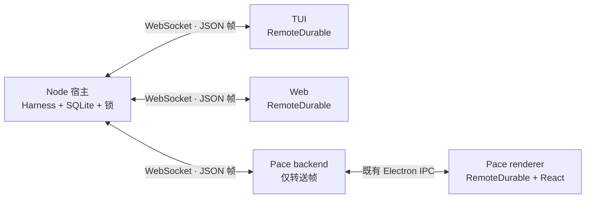

# Durable 多端同屏 spike：Pace 接入结论

- 日期：2026-10-02
- 范围：`@earendil-works/pi-durable@1.0.0`，同一台机器上的 Node 宿主、TUI、Web 与 Pace dev 页面。
- 状态：P4b 完整三端剧本已通过，架构结论已按源码核实。本文不批准生产迁移，也不修改既有 ADR。
- 交接与阶段记录：[HANDOFF](../../.scratch/durable-multiview/HANDOFF.md)。依赖版本：[spike package.json](../../spikes/durable-multiview/package.json)。

## 结论

Pace 可以作为 Durable 的一个普通客户端。宿主独占 Harness 和 SQLite，客户端接收会话、任务与文档的快照及增量，发送命令；客户端退出不决定任务退出。Pace 接入时不必把 Harness 放进 renderer，也不必放宽 renderer 的网络 CSP：backend 持有 WebSocket，复用 Electron IPC 转送帧即可。

这条路径改变的不只是传输。Durable 已负责对话、任务、文档和恢复，Pace 现有的 Pi JSONL、Runtime Gateway 事件、Journal 与 Session Projection 则有另一套身份和持久化职责。spike 把两条路径隔离，尚未证明替换现有会话链路的迁移方案。若继续进入产品设计，建议先明确 Durable 运行时的身份、持久化和生命周期，再决定呈现接缝；不要先把 Durable 状态翻译成旧事件，继而被迫维护两份运行事实。

生产是否迁移、是否与当前 SDK 路径并存仍由后续产品决策确定。Coding Agent 的全部扩展与交互兼容性是一项待评估的取舍，不是本 spike 自行添加的硬约束。

## 1. 传输：backend 中继成立，完整远程协议尚未成立

当前数据路径如下；三端的命令最终都到同一个宿主。

[`frames.ts`](../../spikes/durable-multiview/protocol/frames.ts) 定义 `hello`、`snapshot`、`ops`、`ended`、`result` 和通知。`conversation:<id>`、`tasks`、`conversations`、`approvals` 与 `doc:<kind>:<id>` 各自订阅；[`gateway.ts`](../../spikes/durable-multiview/host/gateway.ts) 先发快照，再转发 watch 的增量。客户端使用 chord 的 `applyImmutable`，不自行实现 delta 应用器。

[`remote-durable.ts`](../../spikes/durable-multiview/protocol/remote-durable.ts) 在断线后重新连接并重新订阅，取新的完整快照，不追索漏掉的历史帧。它丢弃旧连接的迟到消息，失联时拒绝未完成 RPC；token 错误会停止重连。协议层不负责恢复任务，任务由重新打开存储的宿主恢复。

Pace 的 [`durable-bridge.ts`](../../packages/backend/src/spikes/durable-bridge.ts) 不解析帧，renderer 的 [`backend-relay.ts`](../../apps/desktop/src/dev/durable-spike/backend-relay.ts) 将既有 IPC 适配为 `FrameTransport`。[`service.ts`](../../packages/backend/src/service.ts) 用 `seq: 0` 的临时事件传输，不经过 Runtime Gateway 的序号、Journal 或 Session Projection。dev 页面在 [`durable-spike-page.tsx`](../../apps/desktop/src/dev/durable-spike/durable-spike-page.tsx) 复用 Web 的工作台。

生产接入还需要定义以下边界：

- **端到端背压。** 宿主 watch 回调等待 socket 发送，但 Pace backend 到 renderer 的 IPC 没有消费确认或有界队列。socket 已接受一帧不等于界面已处理；需要在这一段补齐限流、快照替换或慢客户端重订阅策略。
- **连接就绪与多流一致性。** 当前重连收到 `hello` 就标记 connected，各流随后分别刷新，没有统一快照版本或原子提交屏障。界面不能把短暂混合的新旧视图当作已同步的决策依据。
- **命令结果不确定。** `submit` 带 `requestId`，但当前客户端不持久保存待确认请求，也不自动以原 ID 重试；`fork`、`compact` 没有应用层幂等键。回复丢失后的查询、重试及用户反馈需要单独设计，不能宣称跨网络 exactly-once。
- **协议与权限。** 两端目前将 `JSON.parse` 结果直接断言为帧类型；没有协议版本协商、完整运行时校验或按操作授权。持有 token 的客户端有完整控制权，审批的 `by` 只是客户端标签，不是可信身份。

当前宿主只监听 `127.0.0.1`，Pace 中继也拒绝非 loopback 地址。这验证了本机边界；SSH 隧道、远程设备身份、加密连接与公网服务均未验收。依据：[transport](../../spikes/durable-multiview/protocol/transport.ts)、[gateway](../../spikes/durable-multiview/host/gateway.ts)、[Pace bridge](../../packages/backend/src/spikes/durable-bridge.ts)。

## 2. 投影：一个客户端写者，Durable 存储是运行事实来源

每个客户端的 `RemoteClient` 独占该连接订阅到的状态，先应用快照或 ops，再发布 `DurableView`。React 和 TUI 只读取这个值。Web 与 Pace 共用 [`presentation/chat.ts`](../../spikes/durable-multiview/presentation/chat.ts) 的派生函数，把 Durable entries、`pi.live`、`pi.inbox` 与 `pi.usage` 转成聊天、队列、进度和用量。

这与 ADR-0044 的单写者原则兼容，但还没有接入生产的 [`session-projections-store.ts`](../../apps/desktop/src/entities/session/session-projections-store.ts)。spike 页面拥有自己的独立模型，不能据此宣称现有 Session Projection 已支持 Durable。生产需要为每个运行实例明确一个持有订阅、历史状态和命令反馈的 owner；页面切换只改变阅读位置，不再复制一份状态。

Durable 的扩展文档通过 `watchDoc` 单独订阅，不隐含在 `ConversationView.docs` 里。当前网关对尚未创建的文档先发 `null`，创建提交到来后再挂 watch。待办、回滚状态、审批决定有各自文档；待审批列表则由内存中的 `ApprovalBoard` 另行发布。后者重启后由钩子重建，不能被解释为一份持久审批收件箱。依据：[gateway](../../spikes/durable-multiview/host/gateway.ts)、[审批板](../../spikes/durable-multiview/host/demo/approvals.ts)、[文档定义](../../spikes/durable-multiview/host/demo/state.ts)。

当前派生层保留中断的 assistant 片段，并区分它与重发后完成的回答；思考块取模型实际提供的内容；用量来自当前会话的 `pi.usage`，不是自行给整棵子代理树求和。`pi.system` 的 section 更新没有作为普通聊天消息显示。长历史分页、终态任务的历史浏览、审计与导出语义仍需产品设计，不能仅靠 live task graph 补齐。

## 3. 子代理：通用会话加所有权，呈现仍需稳定关联

演示的前台 `subagent` 工具在一次提交里，按 `ownerTaskId` 找回或新建子会话；用固定 `requestId: subagent:<taskId>` 找回原请求，用 `details.conversationId` 给界面提供入口。子会话继承配置后只保留对应调查工具。三端可以订阅和驱动它，使用的仍是普通会话命令，不需要为子代理另造一套控制协议。依据：[oncall.ts](../../spikes/durable-multiview/host/demo/oncall.ts)。

所有权决定取消和等待，不等于界面树。任务图展示 live tasks，终态节点会消失；当前聊天派生函数只从运行中工具槽读取子会话链接。生产若要在历史工具卡片上永久跳回子会话，应读取持久结果或会话所有权，明确身份与导航规则，而不能把 live graph 当作历史索引。已有子会话仍可通过会话列表访问。

本次覆盖前台子代理，以及一个 conversation-owned background 提醒任务。background 常驻子代理的 Anchor/Reporter 模式没有在本 spike 实现，不能由提醒任务的成功推导为该模式已验收。是否给用户呈现子代理树、能否直接干预子会话，以及父子会话各自的用量口径，需要单独定产品规则。

## 4. 进程模型：显示端可替换，执行宿主必须有明确负责人

[`openHost`](../../spikes/durable-multiview/host/host.ts) 用 `proper-lockfile` 保证同一数据目录只有一个宿主，打开 SQLite、恢复 registry 与根会话，再调用 `harness.resume()`。token 持久保存以供客户端重连。宿主正常关闭不把未完成任务写成终态；再次打开会继续运行。三个显示端不拥有数据库，也不拥有恢复调度器。

spike 一个 Harness 中包含 main、fork 和子会话，进程故障影响这个存储里的全部会话。它没有验证多个独立根 Session 的 cwd、模块缓存和插件全局变量隔离。现有 [`session-process-entry.ts`](../../packages/backend/src/drivers/session-process-entry.ts) 会在加载扩展前 `process.chdir`，因此不能直接把多个项目塞进一个长期共享进程并假设 ADR-0040 的隔离仍然成立。

若进入生产，建议先保留“独立执行工作区对应受隔离宿主”的能力，另设会话目录与宿主路由；这只是候选设计，不是已选定的部署粒度。需要决定一个宿主承载一个根会话族还是多个根会话、fork 是否独立存储、应用退出时停止宿主还是允许它继续运行，以及谁负责异常重启。Durable 提供恢复机制，并不替 Pace 选择这些生命周期政策。

宿主使用 Node 与其 SQLite 适配器；Bun 在这里是包管理和脚本入口，`host` 实际执行 `node`。桌面生产还未验证将该适配器打入 Electron 后的版本匹配、打包、升级、数据备份与恢复。

## 5. 与现有 ADR 的关系

| ADR | 可保留的原则 | 需要重审或补充的部分 |
| --- | --- | --- |
| [0040 根 Session 进程隔离](../adr/0040-root-session-process-isolation.md) | 执行环境隔离；对象不跨进程；看历史不等于启动执行 | 现有模型是每个根 Session 一个 SDK 进程、插件自管子代理、根进程崩溃不自动重放。spike 是一个 Harness 承载会话族、原生任务所有权、宿主启动即恢复，并向客户端开放子会话控制。生产采用这些行为需更新决定，不能称为无冲突替换。 |
| [0042 chord presentation host](../adr/0042-pace-as-chord-presentation-host.md) | JSON 边界；宿主负责 transport；Pace 作为呈现端；可复用 IPC | ADR 仍是草案，讨论的是附加插件服务的 facet/service/slot，且明确不另开 Pi 会话路径。Durable spike 传输的是完整运行时的 conversation/task/doc，不使用 `RemoteServiceTransport`，也没有实现通用 slot。两者可分工，但共享 chord delta 不代表已经实现该 ADR。 |
| [0044 renderer 单写者](../adr/0044-single-writer-session-projection-in-renderer.md) | 一个 owner 应用状态更新，界面派生读取；旧快照不覆盖新运行状态 | spike 内原则成立，生产 store 尚未接入。采用 Durable 后应重定投影输入和生命周期，不同时把 DurableView 与旧事件 reducer 作为同一会话的权威来源。 |
| [0021 双轨持久化与 Fork/Resume](../adr/0021-session-fork-resume-persistence-layering.md) | Pace 不自行重建模型上下文；阅读与执行分开；fork 不隐含磁盘撤销 | Pi JSONL 为上下文真相、Journal 为呈现真相是现有实现的具体决定。Durable 存储已拥有对话及任务事实，spike 不写 Journal；直接采纳须重定持久化和历史身份。当前 fork 在任意选定 entry 上生成同存储里的会话，未创建 Execution Checkout，也没有旧 Journal 的身份重铸，不能替代现有强制 worktree 的产品 fork。 |

ADR-0042 中记录的 B0“通道判别字段未统一”已经落后于代码：当前 [`session-process-protocol.ts`](../../packages/backend/src/drivers/session-process-protocol.ts) 已使用 `type: request | response | event`。正式接入仍要处理新增消息类型、初始化握手与生命周期，但不应重复把旧 B0 描述为尚未完成。

本次不需要立即推翻上述 ADR。隔离的 dev 页面允许先获取证据；生产方案确定后，再分别更新涉及执行隔离、持久化、呈现 host 和投影所有权的决定。

## 6. 恢复与补偿的准确边界

**`failFast` 只取消仍 live 的兄弟任务，不自动补偿已经完成的副作用。** 1.0.0 调度器的 `#reconcile` 从 live task 集合寻找待取消的成员；`RegionRollback.abort` 则由演示自己定义“恢复流量”。演示特意让失败区域稍晚失败、另外两区仍处于 switching，才会看到它们的 abort 补偿。若某一区已经 terminal/completed，它不再是 live 任务，不能指望同一策略替它回滚。演示源码：[tasks.ts](../../spikes/durable-multiview/host/demo/tasks.ts)。

这里的“恢复流量”只是修改 `demo.rollout` 文档，没有真的切流或执行 shell。真实外部副作用需要幂等键、效果记录和业务补偿任务；已完成效果是否撤销、如何重试补偿，应由应用显式定义。`replay: "safe"` 是工具实现作出的保证，不会把不幂等的外部调用自动变安全。

任务完成也不等于业务成功：演示的 `demo.rollback` 在收集各区域 outcome 后以 `completed` 返回报告，其中仍包含失败区域。界面必须读报告里的业务结果，不能把父任务 completed 直接显示为“回滚成功”。

审批的先写者胜由 `ApprovalsDoc` 的同提交写入保证，钩子再用 memo 固定决定。重启后不重复询问已决定的审批，有特定测试；这不等于所有审批等待已经持久化。提醒把绝对到期时间存入输入，再用固定 request ID 发送 follow-up，保护的是该条提醒提交，不是任意网络操作的执行次数。依据：[审批与工具](../../spikes/durable-multiview/host/demo/oncall.ts)、[审批竞争实现](../../spikes/durable-multiview/host/demo/approvals.ts)、[提醒任务](../../spikes/durable-multiview/host/demo/tasks.ts)。

## 7. 覆盖、证据与尚未覆盖的内容

以下列出可执行的证据入口，本轮运行结果记录在表后。

| 问题 | 证据入口 | 证明范围 |
| --- | --- | --- |
| 多端流式一致、认证失败、同一任务的控制 | [gateway.test.ts](../../spikes/durable-multiview/test/gateway.test.ts)、[controller.test.ts](../../spikes/durable-multiview/test/controller.test.ts) | 真 WebSocket、本机宿主与确定性模型。 |
| 宿主被 SIGKILL 后恢复，同样的三个子代理 | [crash-recovery.test.ts](../../spikes/durable-multiview/test/crash-recovery.test.ts) | 独立宿主进程；检查视图与子会话身份，非只测正常 close。 |
| Pace backend 的旁路与重连 | [relay.test.ts](../../spikes/durable-multiview/test/relay.test.ts)、[backend-relay.test.ts](../../apps/desktop/src/dev/durable-spike/backend-relay.test.ts) | 中继协议与 renderer 事件适配；Electron 整体由下项覆盖。 |
| 三个真实界面互相驱动、断线恢复 | [three-clients.mjs](../../spikes/durable-multiview/scripts/three-clients.mjs) | TUI PTY、浏览器、Pace dev Electron；独立 profile、数据目录和端口。 |
| 待办、并行子代理、审批竞争及重启、补偿、提醒、fork 文档策略、压缩、热替换 | [demo.test.ts](../../spikes/durable-multiview/test/demo.test.ts) | 确定性模型下的机制断言；提醒与已批准回滚另有重启用例。 |
| 文件连续两次原子保存后的热替换 | [host-reload.test.ts](../../spikes/durable-multiview/test/host-reload.test.ts) | 真实宿主监听文件变更，而非只直接调用 reload。 |
| 断线时保留草稿与禁用执行、390px 布局 | [web-ui.test.ts](../../spikes/durable-multiview/test/web-ui.test.ts) | 界面交互回归；实际布局另有 dev-server 截图。 |
| 完整剧本、三个界面的审批与队列、Pace 对 busy 子会话发 steer、三端压缩、思考块与窄屏 | [demo-scenario.mjs](../../spikes/durable-multiview/scripts/demo-scenario.mjs)、[TUI 测试](../../spikes/durable-multiview/test/tui.test.ts) | 三端剧本使用 `--faux-demo`；真实模型的行为只能由独立冒烟证据支持。 |

2026-10-02 本轮验收（含 PR #432 检视修复）：根 `bun run test` 通过 168 个文件、1975 个测试；spike `bun run test` 通过 12 个文件、51 个测试；根 `typecheck`、`lint`、`build` 及 spike `typecheck` 全部通过。完整 `bun run verify:demo` 退出码为 0，完成 12 幕，包含三端审批与队列、SIGKILL 后保持相同三个子会话、补偿、提醒、fork、三端压缩、热替换、用量和思考内容。脚本使用隔离数据目录，并为本轮 Pace 实例选择独立端口及验证连接地址。

截图与 TUI 屏幕文本保存在本机 [output/durable-multiview-p4b-20261002](../../output/durable-multiview-p4b-20261002)（gitignored，不随 PR 提交）。关键界面证据：[Pace 审批与队列](../../output/durable-multiview-p4b-20261002/06-approval-and-queue-pace.png)、[宿主恢复](../../output/durable-multiview-p4b-20261002/03-recovered-pace.png)、[390px 手机布局](../../output/durable-multiview-p4b-20261002/12-phone-web.png)、[900px 面板弹窗](../../output/durable-multiview-p4b-20261002/12-narrow-web.png)。Pace 正文背景与窄屏布局已经本轮 dev-server 截图确认。

既有 P0–P4a 的真模型冒烟见 [HANDOFF §10–§14](../../.scratch/durable-multiview/HANDOFF.md)；不能把这些历史冒烟当作本轮完整三端真模型验收。

推荐复跑入口：在 `spikes/durable-multiview` 中执行 `bun run test`、`bun run typecheck`、`bun run verify:demo`。P3 的旧 `verify:three` 仍使用固定端口，复跑前需检查占用；本轮完整验收以 `verify:demo` 为准。两个界面脚本内部使用 Node，PTY 不在 Bun runtime 下运行。

本 spike 没有覆盖：真实 bash/文件/网络副作用、后台常驻子代理、完整 Coding Agent 扩展生态、任意扩展 GUI facet 加载、自定义存储、Bun 或 Durable Object 宿主、任务版本迁移、提示缓存差量、跨版本数据迁移，以及旧 Pi JSONL/Journal 到 Durable 的迁移。远程安全、多宿主路由、无界历史与多客户端高负载也没有被本机演示证明。

PR #432 检视发现的固定摘要虚构回滚、无正文回答丢失 Fork 两项问题均已修复。演示摘要改为摘录实际工具结果，测试覆盖执行前、批准后、拒绝后及再次压缩；Fork 和 interrupted 标记移到消息级，纯思考和纯工具回答也可创建分支，流式和中断回答仍不可 fork。新增 [桌面截图](../../output/durable-multiview-review-fork-20261002/fork-without-text-desktop.png)、[390px 截图](../../output/durable-multiview-review-fork-20261002/fork-without-text-phone.png) 已检查，完整剧本复验证据在 [output/durable-multiview-pr432-fixes-20261002](../../output/durable-multiview-pr432-fixes-20261002)。

复验曾遇到旧 Web 测试的偶发页面加载超时，根因未定位；移除临时诊断后的最终原始命令已通过全部 51 项，未改超时或运行配置，详见 [HANDOFF §15.4](../../.scratch/durable-multiview/HANDOFF.md)。390px 布局已经验证，但 Astryx 默认按钮仍为 md 32px / sm 28px，尚未完成 44px 触控目标的生产验收。

进入生产设计前最值得继续回答的三个问题是：Durable 会话如何映射 Pace Session 与 Execution Checkout；谁拥有宿主启动、退出与恢复政策；哪些历史和审计信息必须独立于 live watch 保留。回答这些之后，才有足够依据选择迁移、并存或停止推进。
